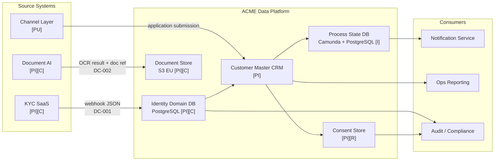
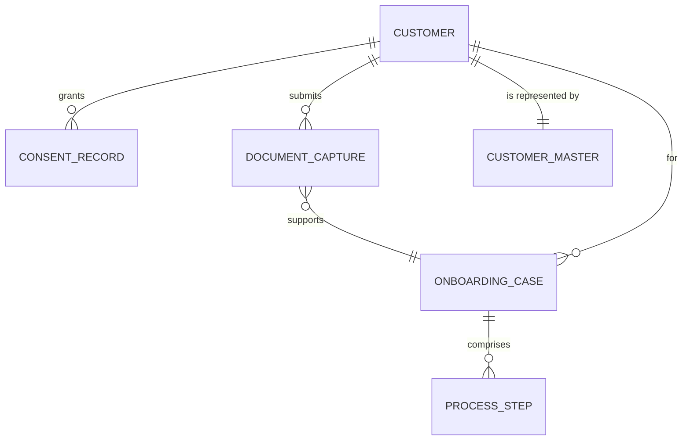

# Data Architecture Review — ACME Corp Customer Onboarding (Phase C)

**Date:** 2025-04-03
**Engagement:** ACME Corp — Customer Onboarding Modernisation
**ADM Phase:** C — Information Systems Architecture (Data)
**Reviewer:** Head of Enterprise Architecture (Marcus Webb)
**Subject:** Data architecture for Customer Onboarding modernisation — covering Customer Identity, Customer Master, Consent Records, Onboarding Process State, and Document Capture domains
**Producing skill:** `/data-architecture`

---

> [!abstract]
> **Needs Work.** The data architecture covers the right domains but has two Critical gaps: Consent Records are co-mingled in the operational CRM without segregation (GDPR Art. 7 non-compliance) and Onboarding Process State has no named Data Owner. Three schema contracts are missing before the KYC SaaS integration can go live. No finding requires a topology redesign — all gaps are remediable within Phase C.

---

## Data Architecture Verdict: Needs Work

---

## Data Flow Diagram

Current state: four legacy CRM databases exchanging data via flat file exports, no schema contracts, no data catalogue.

Target state (post-modernisation):

*[PI] = Personal; [C] = Confidential; [R] = Restricted; [PU] = Public; [I] = Internal. Annotation follows data-architecture classification convention.*

---

## Conceptual Data Diagram (TOGAF Phase C — Data)

*Conceptual Data Diagram — entity relationships across the five Customer Onboarding data domains; platform-independent.*

---

## Data Quality Attribute Assessment

| Attribute | Finding | Confidence | Severity | Owner (role) | Review trigger |
|-----------|---------|------------|----------|--------------|----------------|
| **Data Quality** (accuracy / completeness / timeliness / consistency / uniqueness) | No completeness or accuracy SLAs defined for any domain. Duplicate customer records estimated at 4–6% in legacy CRM 1 (source: legacy ops team estimate). The 11-day average cycle is partly caused by manual re-verification triggered by identity data quality failures. | [informed estimate] | High | Identity Architect (Priya Sharma) | When identity data quality SLAs are established and first measurement is taken |
| **Data Governance** (ownership / stewardship / classification / catalogue / lineage) | No data catalogue. Data Owner defined for 2 of 5 domains (Customer Identity, Customer Master). Onboarding Process State and Document Capture have no named owner — gap. Classification scheme exists at policy level but is not enforced at data layer. | [proven — governance artefact review] | Critical | Head of EA (Marcus Webb) | When all 5 domains have a named Data Owner and are listed in a data catalogue |
| **Privacy by Design** (GDPR / retention / residency / consent) | Consent Records co-mingled in legacy CRM operational table — GDPR Art. 7 compliance cannot be demonstrated. No consent withdrawal mechanism implemented. Retention schedule defined in policy (5yr customer master, 7yr identity/documents, 3yr post-withdrawal for consent) but not enforced at data layer. All domains confirmed EU-resident. | [proven — architectural document review] | Critical | CISO (David Okafor) | Before go-live; consent store separation is a hard acceptance criterion in ACME-ARCH-CON-2025-001 |
| **Interoperability** (contracts / schema governance / versioning) | No schema contracts between any producer-consumer pair. KYC SaaS webhook payload not formally specified — integration relies on vendor documentation only. Legacy CRM flat file export has no versioning; schema changes in source CRM will break downstream silently. | [proven] | High | Identity Architect (Priya Sharma) | When DC-001 and DC-002 contracts are formalised and schema registry is operational |
| **Scalability** (volume / partitioning / archival) | Not a primary risk at current volume (≤500 onboarding completions/day). Legacy identity tables have no partitioning — risk materialises at >5,000/day. Target architecture uses PostgreSQL with standard indexing; partition strategy should be defined before H2 volume targets are reached. | [working hypothesis] | Low | Identity Architect (Priya Sharma) | When daily onboarding volume exceeds 2,000 completions |
| **Observability** (quality monitoring / lineage / anomaly detection) | No data quality monitoring in place. No lineage tracing beyond manual ETL documentation. Anomalous identity data (e.g., mismatched document expiry) detected only during manual review — no automated alerting. | [proven] | High | Head of EA (Marcus Webb) | When Phase D technology architecture defines the observability stack |

---

## Data Classification Matrix

| Data domain | Sensitivity | Personal data? | Legal basis | Retention | Residency | Owner (role) |
|------------|-------------|---------------|-------------|-----------|-----------|--------------|
| Customer Identity | Confidential | Yes | Contract (GDPR Art. 6(1)(b)) | Active + 7yr post-offboarding | EU | Identity Architect (Priya Sharma) |
| Customer Master | Internal | Yes | Contract (GDPR Art. 6(1)(b)) | Active + 5yr | EU | Customer Operations Director (Tom Hayward) |
| Onboarding Process State | Internal | No (process metadata only) | N/A — operational | 7yr (audit trail) | EU | **Undefined — gap** |
| Consent Records | Restricted | Yes | Consent (GDPR Art. 7) | Active + 3yr post-withdrawal | EU | CISO (David Okafor) — acting |
| Document Captures | Confidential | Yes | Contract (GDPR Art. 6(1)(b)) | 7yr post-completion | EU | **Undefined — gap** |

> [!warning]
> Onboarding Process State and Document Capture have no named Data Owner. Both domains contain personal data references (via Customer Identity foreign keys). This is a GDPR accountability gap — ACME cannot demonstrate compliance with Art. 5(2) (accountability principle) for these domains.

---

## Data Contract Register

| Contract ID | Producer | Consumer | Schema format | Registry | SLA | Contract owner | Status |
|-------------|---------|----------|--------------|----------|-----|----------------|--------|
| DC-001 | KYC SaaS (vendor) | Customer Identity Domain DB | JSON (vendor-defined) | None — gap | Webhook delivery ≤30s; 99.5% availability | Identity Architect (Priya Sharma) | **Missing — gap** |
| DC-002 | Document AI service | Document Store | JSON (internal) | None — gap | Delivery ≤60s; OCR confidence score included | Identity Architect (Priya Sharma) | **Missing — gap** |
| DC-003 | Customer Master CRM | Consent Store | TBD | None — gap | Real-time sync on consent change | CISO (David Okafor) | **Missing — gap** |

> [!important]
> All three contracts are missing before the integration layer goes live. DC-001 failure (KYC SaaS webhook) would silently drop identity verification events — onboarding cases would stall without observable failure. DC-001 must be formalised with the KYC SaaS vendor as a go-live gate in the Architecture Contract.

---

## Data Governance RACI

| Data domain | Data Owner (accountable) | Data Steward (responsible for quality) | Custodian (storage / access) | Key consumers |
|------------|--------------------------|---------------------------------------|------------------------------|--------------|
| Customer Identity | Priya Sharma (Identity Architect) | TBD — assign during Phase C | Platform Engineering | KYC SaaS, Onboarding BPM, Ops Reporting |
| Customer Master | Tom Hayward (Customer Operations Director) | Customer Operations | Platform Engineering | All domains, Ops Reporting |
| Onboarding Process State | **Unassigned — gap** | **Unassigned** | Platform Engineering | BPM Engine, Notification Service, Audit |
| Consent Records | David Okafor (CISO) — acting | Legal / DPO | Platform Engineering | Customer Master, Audit / Compliance |
| Document Captures | **Unassigned — gap** | **Unassigned** | Platform Engineering | Identity Domain, KYC SaaS, Audit |

---

## Topology Assessment

**Current topology:** Four independent operational CRM databases + flat file export between systems. No master data management. No schema governance.

**Target topology:** Federated hub — Customer Master CRM as the system of record; identity data sourced from KYC SaaS via contract-governed webhook; process state in Camunda BPM PostgreSQL; consent data in a dedicated isolated store; documents in EU-resident object storage with metadata in PostgreSQL.

**Assessment:** The target topology is appropriate for ACME's data maturity, team size (~4 platform engineers), and H2 volume. The federated hub pattern is less ambitious than data mesh (appropriate — ACME does not have domain teams capable of owning data products independently) and avoids the operational overhead of a centralised data warehouse for operational data.

**Reversibility:** two-way door [informed estimate] — the target topology uses standard PostgreSQL and a commercial CRM; migration to an alternative master data approach is achievable within a 6-month project. The KYC SaaS integration (DC-001) is the most constrained edge — vendor contract terms govern schema change notice periods.

---

## Privacy & Data Protection Check

**GDPR posture:** Partial compliance. Legal basis identified for all personal data domains. Data minimisation not formally assessed — document captures may retain more OCR-extracted fields than strictly necessary for onboarding completion. Retention schedules defined at policy level but not enforced at data layer (no automated archival or deletion jobs).

**Critical gap:** Consent Records co-mingled in legacy CRM operational table. GDPR Art. 7 requires that consent be demonstrably given, recorded, and withdrawable. Co-mingling with operational data makes withdrawal audit impractical and creates a compliance liability.

**AI Act scope:** The Document AI service performs OCR and document authenticity scoring. If the authenticity score is used as a determinative input to KYC pass/fail decisions, this is a Limited-risk AI system under the AI Act — transparency obligations apply. If the score is advisory (human reviewer makes final decision), no additional obligation. Architecture Contract must specify which applies.

> [!important]
> Consent Records must be separated into a dedicated store before Phase G go-live. This is a one-way door for GDPR compliance — once operational data and consent data are co-mingled at scale, separation becomes a data migration project of significant complexity.

---

## Governance Blind Spot

No schema contract governs the KYC SaaS webhook (DC-001). If the vendor changes the webhook payload schema (e.g., adds a required field, renames an attribute), the Customer Identity Domain DB ingestion layer will fail silently — onboarding cases will stall at the identity verification step, and the failure will not be visible in ACME's monitoring until customers report non-completion. This is the highest-probability data reliability risk in the target architecture and must be resolved before the KYC SaaS integration goes live.

---

## Commoditisation Check

ACME's planned approach to data quality monitoring is to build a custom alerting layer on top of the PostgreSQL tables. This is custom-building something that is drifting toward commodity — **Great Expectations** (open-source) or **Monte Carlo** (SaaS) cover this function. Exit trigger: if the custom monitoring layer requires >2 engineer-weeks of maintenance in any quarter, evaluate Great Expectations adoption.

---

## Disruptive Alternative

Adopt a **data mesh** topology — each onboarding domain team (Identity, Customer, Document) owns and serves its data as a product with a versioned interface. This eliminates the central data dependency graph and would make domain-level schema changes non-breaking. Not chosen for H2: ACME does not yet have domain-aligned engineering teams capable of owning data products independently, and the investment in platform infrastructure (self-serve data platform) is not in the €12M capex envelope. Re-evaluate at H3 if domain teams are established and onboarding volume exceeds 5,000/day.

---

## Second-Order Effect

The consent store being a new, isolated service (not co-located with any existing system) creates a dependency that every downstream consumer of Customer Master data must resolve: before acting on a customer record, they must check consent status. If the consent store is unavailable, should downstream systems fail open (proceed without consent check) or fail closed (block the operation)? This design decision will cascade into the Notification Service, the Document AI service, and the Ops Reporting layer — and must be resolved in the Application Architecture (Phase C — Application) before the integration layer is designed. [informed estimate]

---

## Gap Analysis (Data Layer)

| Gap ID | Domain | As-Is | To-Be | Gap type | Priority | Reversibility | Owner (role) | Review trigger |
|--------|--------|-------|-------|----------|----------|---------------|--------------|----------------|
| GAP-DA01 | Consent Records | Co-mingled in legacy CRM | Dedicated isolated consent store | New | P1 — go-live gate | one-way door | CISO (David Okafor) | Before Phase G go-live |
| GAP-DA02 | Process State | No named Data Owner | Named Data Owner + steward in RACI | Uplift | P1 | two-way door | Head of EA (Marcus Webb) | Before Phase C sign-off |
| GAP-DA03 | Document Captures | No named Data Owner | Named Data Owner + steward in RACI | Uplift | P1 | two-way door | Head of EA (Marcus Webb) | Before Phase C sign-off |
| GAP-DA04 | KYC SaaS → Identity (DC-001) | No schema contract | Formalised JSON schema contract + schema registry | New | P1 — integration gate | two-way door | Identity Architect (Priya Sharma) | Before KYC SaaS integration goes live |
| GAP-DA05 | Document AI → Document Store (DC-002) | No schema contract | Formalised contract + versioning | New | P2 | two-way door | Identity Architect (Priya Sharma) | Before Document AI integration goes live |
| GAP-DA06 | All domains | No data quality SLAs | SLAs defined and monitored per domain | Uplift | P2 | two-way door | Identity Architect (Priya Sharma) | When Phase D observability stack is defined |

---

## Horizon Alignment

**H1 — Immediate data health:** GAP-DA01 (consent separation) and GAP-DA04 (DC-001 contract) are go-live gates — must be resolved before Phase G. GAP-DA02/03 (missing owners) must be resolved before Phase C sign-off. These are not technical debt items; they are compliance prerequisites.

**H2 — Governance maturity:** Establish data quality SLAs (GAP-DA06), schema registry, and data catalogue across all five domains. Evaluate commodity data quality monitoring tools. Define the consent-check fail-open/fail-closed policy for downstream services.

**H3 — Platform evolution:** If domain teams become established, evaluate data mesh topology. If onboarding volume exceeds 5,000/day, evaluate partitioning strategy and event-streaming ingestion for identity events.

---

## TOGAF Context

**ADM phase:** C — Information Systems Architecture (Data)

**Impacted building blocks:**
- Customer Identity ABB — new (KYC SaaS + Identity Domain DB)
- Customer Master ABB — replace (legacy CRM → new CRM)
- Consent Management ABB — new (dedicated consent store)
- Document Management ABB — new (Document Store + Document AI)
- Onboarding Process State ABB — new (Camunda BPM PostgreSQL)

**Gap analysis completeness:** Phase C Data ADD is partially complete. The Data Entity/Data Component Catalog requires Population for all five domains. The Application/Data Matrix (CRUD mapping) has not yet been produced — this is an open artefact gap before Phase C sign-off. See `references/togaf-content-framework.md` for the full Phase C — Data canonical artefact inventory.

---

## Broad Responsibility

Identity and consent data for ACME's customers is in scope. A data breach of the Consent Records or Customer Identity domain would constitute a GDPR notifiable breach (Art. 33 — 72-hour notification to supervisory authority). The Document Capture domain retains copies of government-issued identity documents — the most sensitive personal data category in this architecture. If ACME's customers are themselves businesses onboarding end-users, a breach propagates to a second tier of data subjects (customers-of-customers) who have no direct relationship with ACME. The Architecture Contract acceptance criteria must include penetration testing of the consent store and identity domain endpoints before go-live.

---

## Standards Bar

Does this meet the bar for a client deliverable? Yes — all six DAMA-DMBOK dimensions assessed with rationale; all five data domains classified with owner, retention, and residency; three missing data contracts identified with go-live gate status; GDPR Art. 7 gap named with specific remediation; discipline markers present on every finding. The RACI is incomplete (two gaps) — this is a finding, not a gap in the assessment.
