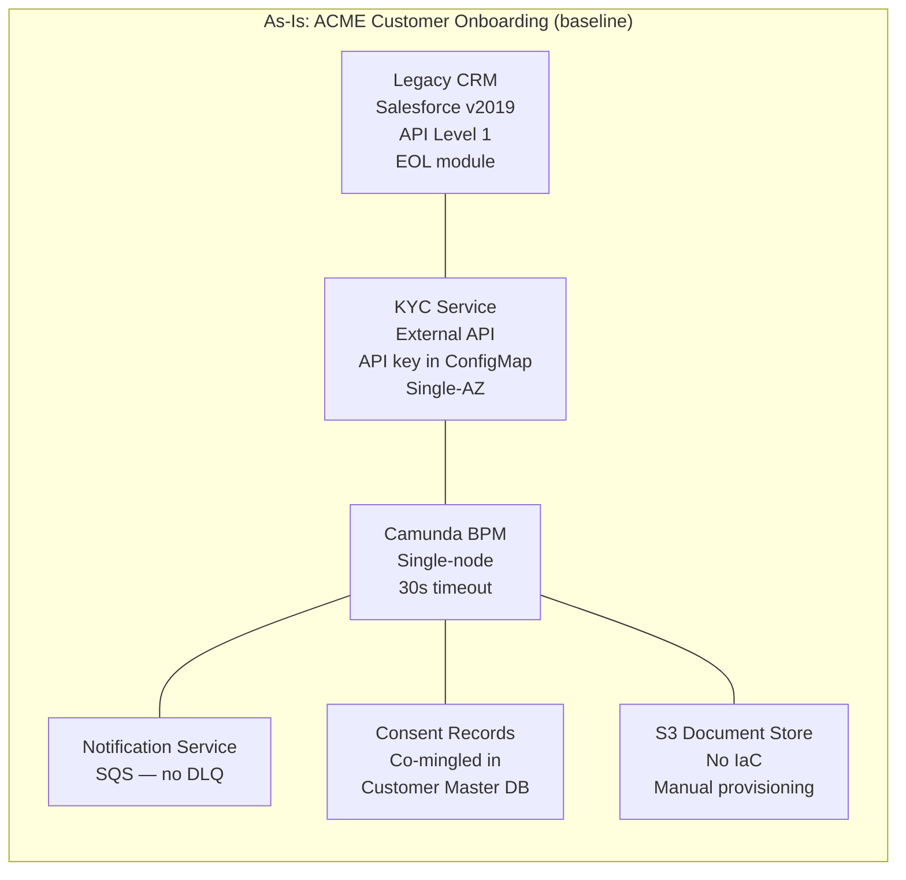
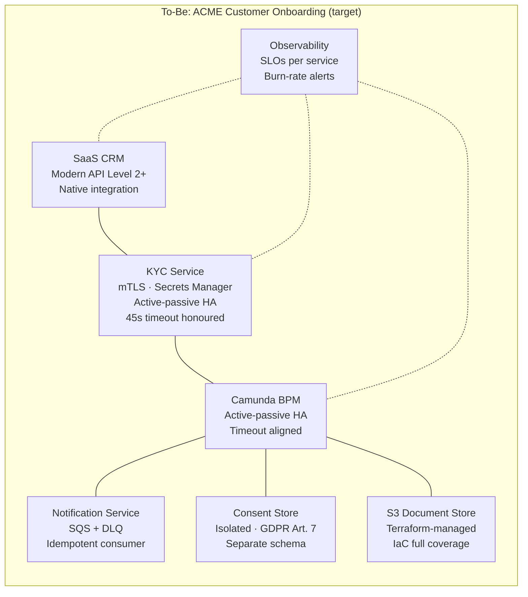
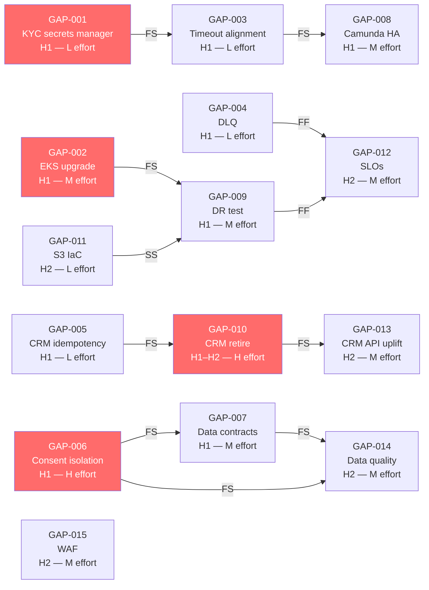
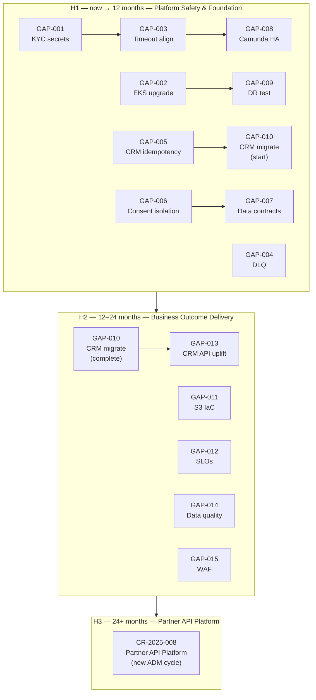

# Phase E Gap Analysis — ACME Corp Customer Onboarding

**Engagement:** ACME Corp Customer Onboarding Modernisation — Phase 1  
**Lead Architect:** Marcus Webb, Head of Enterprise Architecture  
**Architecture Sponsor:** Sarah Chen, Chief Customer Officer  
**Business target:** Reduce average onboarding cycle 11 days → ≤3 days  
**Sources:** Phase B capability assessment · Phase C data and integration architecture reviews · Phase D technology architecture review  
**Planning horizon:** H1–H3 (36 months)

---

## Executive Summary

> [!abstract]
> ACME's Customer Onboarding estate has seven domains assessed across 15 gaps. Five are P1 Critical — two security failures, two integration reliability defects, and one regulatory breach (consent record co-mingling under GDPR) — that must be resolved before any new onboarding volume is added. The critical path runs through CRM replacement: retiring the EOL CRM module and re-platforming to a modern SaaS CRM is the single longest-lead item and the H2 gate that unlocks the ≤3-day cycle target. A platform that is not production-safe (security, DR, integration reliability) cannot safely absorb new volume; fixing safety first is not deferred value — it is the pre-condition for delivering the business outcome.

---

## As-Is / To-Be Maturity Heat Map

| Domain | As-Is (0–4) | To-Be target | Delta | Phase | RAG |
|--------|------------|-------------|-------|-------|-----|
| Security & Secrets Management | 1 — Initial | 3 — Managed | +2 | H1 | 🔴 |
| Integration Reliability | 1 — Initial | 3 — Managed | +2 | H1 | 🔴 |
| Onboarding Orchestration (BPM) | 2 — Defined | 3 — Managed | +1 | H1 | 🟡 |
| CRM / Customer Data | 1 — Initial | 3 — Managed | +2 | H1–H2 | 🔴 |
| Data Governance | 1 — Initial | 3 — Managed | +2 | H1–H2 | 🔴 |
| Technology Platform (EKS, IaC, DR) | 1 — Initial | 3 — Managed | +2 | H1–H2 | 🔴 |
| Observability & SLOs | 0 — Not Defined | 3 — Managed | +3 | H1–H2 | 🔴 |

**RAG key:** 🔴 As-Is = 0–1 · 🟡 As-Is = 2 · 🟢 As-Is = 3–4

---

## Gap Table

| ID | Domain | Gap | Type | As-Is | To-Be | Priority | Effort | Phase | Reversibility | Verification criterion | Confidence | Owner (role) | Review trigger |
|----|--------|-----|------|-------|-------|----------|--------|-------|---------------|----------------------|------------|--------------|----------------|
| GAP-001 | Security | KYC API key stored in Kubernetes ConfigMap — rotate to AWS Secrets Manager; inject at pod startup | Transform | 1 | 3 | P1 | L | H1 | two-way | KYC pod starts with no environment variable containing a raw API key; secret is fetched from Secrets Manager at runtime | informed estimate | Priya Sharma (Identity Architect) | Re-assess if KYC vendor changes auth model |
| GAP-002 | Technology Platform | EKS 1.28 is past EOL (March 2025) — upgrade to EKS 1.29 minimum, 1.30 preferred | Uplift | 1 | 2 | P1 | M | H1 | two-way | Cluster version ≥1.29 confirmed in AWS Console; all node groups on matching AMI | proven | Marcus Webb (Head EA) | Upgrade if any subsequent EKS version reaches 6-month-to-EOL threshold |
| GAP-003 | Integration Reliability | BPM timeout (30s) shorter than KYC SLA (45s) — timeout cascade causes silent KYC retry failures | Uplift | 1 | 2 | P1 | L | H1 | two-way | End-to-end onboarding test suite passes with KYC response at 42s; no spurious retry logged | informed estimate | Priya Sharma (Identity Architect) | Re-assess if KYC vendor changes SLA |
| GAP-004 | Integration Reliability | No Dead Letter Queue on SQS notification queue — failed messages lost silently | New | 0 | 2 | P1 | L | H1 | two-way | DLQ configured; CloudWatch alarm fires within 5 min when DLQ depth > 0 | proven | Marcus Webb (Head EA) | Re-assess if notification volume grows >10× current baseline |
| GAP-005 | Integration Reliability | CRM write endpoint non-idempotent — duplicate customer records created on retry | Uplift | 1 | 2 | P1 | L | H1 | two-way | Idempotency key (correlation-id header) accepted by CRM; second call with same key returns existing record | informed estimate | Tom Hayward (Customer Ops Director) | Re-assess if CRM is replaced in H2 (GAP-010 supersedes this fix) |
| GAP-006 | Data Governance | GDPR Art. 7 breach — consent records co-mingled in Customer Master DB; no separate processing basis | Transform | 1 | 3 | P1 | H | H1 | one-way | Consent records in dedicated schema with independent backup and retention policy; DPO signed off | working hypothesis | David Okafor (CISO) | Re-assess if regulatory regime changes; DPO sign-off required before H2 begins |
| GAP-007 | Data Governance | Three missing data contracts (DC-001: CRM→BPM, DC-002: KYC→BPM, DC-003: BPM→Consent Store) — consumers have no guaranteed schema stability | New | 0 | 2 | P1 | M | H1 | two-way | Data contracts published to schema registry; CI pipeline rejects schema-breaking changes | informed estimate | Priya Sharma (Identity Architect) | Re-assess when any producer service is replaced |
| GAP-008 | Onboarding Orchestration | Camunda BPM single-node — no HA; pod restart halts all in-flight onboarding cases | Uplift | 2 | 3 | P1 | M | H1 | two-way | Camunda active-passive confirmed: kill primary pod; secondary takes over within 60s; zero in-flight cases lost | informed estimate | Marcus Webb (Head EA) | Re-assess when onboarding volume exceeds 500 concurrent cases |
| GAP-009 | Technology Platform | DR procedure never tested — RTO/RPO unvalidated; actual recovery time unknown | Uplift | 1 | 2 | P1 | M | H1 | two-way | DR runbook executed; RTO achieved ≤4h; RPO ≤1h; results documented and signed by Marcus Webb | informed estimate | Marcus Webb (Head EA) | Re-run DR test annually or after any infrastructure topology change |
| GAP-010 | CRM / Customer Data | EOL CRM module (Salesforce v2019) — vendor end-of-support reached; integration blocked at API Level 1 | Eliminate | 1 | 3 | P1 | H | H1–H2 | one-way | Legacy CRM decommissioned; all customer records migrated to new SaaS CRM; zero production reads against old CRM | working hypothesis | Tom Hayward (Customer Ops Director) | Re-assess vendor selection if CRM market consolidates or ACME changes cloud provider |
| GAP-011 | Technology Platform | S3 document store provisioned manually — no IaC; configuration drift risk | Uplift | 1 | 2 | P2 | L | H2 | two-way | S3 bucket config in Terraform; terraform plan shows no drift; no manual console changes in 90 days | informed estimate | Marcus Webb (Head EA) | Re-assess if infrastructure team adopts Pulumi or CDK |
| GAP-012 | Observability & SLOs | No SLOs defined for any onboarding service — incidents diagnosed by guesswork | New | 0 | 3 | P2 | M | H2 | two-way | SLO dashboards live for BPM, KYC, CRM, Notification; burn-rate alert fires in staging when error budget consumed >10% in 1h | informed estimate | Priya Sharma (Identity Architect) | Re-assess when error budget policy is approved by Architecture Board |
| GAP-013 | CRM / Customer Data | Legacy CRM API at Richardson Level 1 (single URI, all HTTP verbs POST) — prevents reliable retry and pagination | Uplift | 1 | 3 | P2 | M | H2 | two-way | New CRM API at Level 2 minimum (resource-based URIs, correct HTTP verbs); idempotency keys supported | informed estimate | Tom Hayward (Customer Ops Director) | Superseded if GAP-010 selects SaaS CRM with Level 2+ API out of the box |
| GAP-014 | Data Governance | No data quality controls on Customer Master — data defects discovered at KYC stage cause onboarding failures | New | 0 | 3 | P2 | M | H2 | two-way | Data quality dashboard live; >95% records pass completeness and format checks before KYC submission | informed estimate | Priya Sharma (Identity Architect) | Re-assess if onboarding failure rate falls below 2% |
| GAP-015 | Security | No WAF or rate limiting on public-facing onboarding entry point — path to credentials brute force | New | 0 | 3 | P2 | M | H2 | two-way | WAF rules active; rate limiting configured (100 req/min per IP); penetration test passed | informed estimate | David Okafor (CISO) | Re-assess if public onboarding volume grows 5× or Partner API (CR-2025-008) goes live |

> [!important] One-way door gaps
> - **GAP-006** (consent record isolation): once consent records are migrated to an isolated schema with independent retention, re-merging them into the Customer Master DB would violate the GDPR isolation purpose. The schema separation is permanent.
> - **GAP-010** (CRM decommission): once the legacy CRM module is decommissioned and data migrated, reinstating it requires full re-migration and vendor reactivation. Vendor has confirmed the EOL module cannot be reactivated after decommission.

> [!warning] Regulatory / deadline-driven gaps
> - **GAP-006**: GDPR Art. 7 — consent records must have a separate processing basis from the Customer Master. The DPO has flagged this as a compliance breach requiring remediation before any increase in onboarding volume. No regulatory deadline is published, but a subject access request or regulatory inspection would surface this finding immediately.

---

## Dependency Map

**Precedence table:**

| Gap | Upstream blockers (must finish first) | Downstream unlockers (this enables) | Dependency type |
|-----|--------------------------------------|-------------------------------------|----------------|
| GAP-001 | none | GAP-003 (secrets in place before timeout tuning makes KYC reliable end-to-end) | — |
| GAP-002 | none | GAP-009 (DR test on a supported cluster) | — |
| GAP-003 | GAP-001 | GAP-008 (timeout aligned before HA makes sense) | FS |
| GAP-004 | none | GAP-012 (DLQ in place before notification SLO can be measured) | — |
| GAP-005 | none | GAP-010 (idempotency fix buys time until CRM is replaced) | — |
| GAP-006 | none | GAP-014 (consent isolation required before quality monitoring is meaningful) | — |
| GAP-007 | GAP-006 | GAP-014 (data contracts define quality expectations) | FS |
| GAP-008 | GAP-003 | — | FS |
| GAP-009 | GAP-002 | GAP-012 (DR tested before SLOs locked in) | FS |
| GAP-010 | GAP-005 (buys stability during migration), GAP-013 (API uplift spec is input to CRM selection) | GAP-013 (resolved by new CRM) | FS |
| GAP-011 | none | GAP-009 (IaC drift resolved before DR procedure documented as repeatable) | SS |
| GAP-012 | GAP-004, GAP-009 | — | FF |
| GAP-013 | GAP-010 | — | FS |
| GAP-014 | GAP-006, GAP-007 | — | FS |
| GAP-015 | none | CR-2025-008 Partner API (WAF required before external API exposure) | — |

**Dependency DAG:**

*Critical path highlighted in red*

**Critical path:** GAP-005 → GAP-010 → GAP-013. Estimated duration: 18–20 months [informed estimate]. GAP-010 (CRM replacement) is the longest-lead item — vendor selection, data migration, UAT, and parallel run. If CRM selection slips past month 3 of H1, the ≤3-day cycle target cannot be met within H2.

---

## Swimlane Convergence Diagram

---

## Impact × Effort Prioritisation

| Quadrant | Gaps | Action |
|----------|------|--------|
| **Quick wins** — High impact, Low effort | GAP-001, GAP-003, GAP-004, GAP-005 | Do immediately — all four can ship within 4 weeks; together they eliminate the three Critical integration anti-patterns identified in Phase C |
| **Strategic investments** — High impact, High effort | GAP-006 (consent isolation), GAP-010 (CRM replacement) | Plan in Q1 H1 — long lead times require sponsor commitment now; both are one-way doors |
| **Fill-ins** — Low impact, Low effort | GAP-011 (S3 IaC) | Schedule in H2 alongside platform work; low urgency but eliminates drift risk |
| **Deprioritise** — Low impact, High effort | None identified | — |

---

## Sequenced Roadmap

### H1 (now → 12 months) — Platform Safety & Foundation

**Sponsor (executive role):** Sarah Chen, Chief Customer Officer

| Gap | Item | Key deliverable | Owner (role) | Reversibility | Confidence |
|-----|------|-----------------|--------------|---------------|------------|
| GAP-001 | KYC secrets manager | API key rotated; Secrets Manager in production | Priya Sharma | two-way | informed estimate |
| GAP-002 | EKS upgrade | Cluster at EKS 1.29+; node groups updated | Marcus Webb | two-way | proven |
| GAP-004 | DLQ on notification queue | SQS DLQ configured; CloudWatch alarm live | Marcus Webb | two-way | proven |
| GAP-003 | BPM–KYC timeout alignment | BPM timeout set to 60s; e2e test at 42s passes | Priya Sharma | two-way | informed estimate |
| GAP-005 | CRM idempotency key | Retry with same correlation-id returns existing record | Tom Hayward | two-way | informed estimate |
| GAP-006 | Consent record isolation | Dedicated Consent schema; DPO sign-off | David Okafor | one-way | working hypothesis |
| GAP-007 | Data contracts DC-001–DC-003 | Contracts in schema registry; CI enforcement live | Priya Sharma | two-way | informed estimate |
| GAP-008 | Camunda HA | Active-passive confirmed; 60s failover tested | Marcus Webb | two-way | informed estimate |
| GAP-009 | DR test | Runbook executed; RTO ≤4h validated; results signed | Marcus Webb | two-way | informed estimate |
| GAP-010 | CRM migration — start | Vendor selected; data migration plan agreed; parallel run underway | Tom Hayward | one-way | working hypothesis |

### H2 (12–24 months) — Business Outcome Delivery

**Sponsor (executive role):** Sarah Chen, Chief Customer Officer

**H2 unlock trigger:** All P1 gaps confirmed closed at H1 gate review; CRM parallel run stable for 30 days with zero data-loss incidents

| Gap | Item | Key deliverable | Owner (role) | Reversibility | Confidence |
|-----|------|-----------------|--------------|---------------|------------|
| GAP-010 | CRM migration — complete | Legacy CRM decommissioned; all records migrated; zero reads against old system | Tom Hayward | one-way | working hypothesis |
| GAP-013 | CRM API uplift | New CRM API at Level 2+; idempotency keys supported out of the box | Tom Hayward | two-way | informed estimate |
| GAP-011 | S3 IaC | S3 bucket in Terraform; drift detection active | Marcus Webb | two-way | informed estimate |
| GAP-012 | SLOs and burn-rate alerts | SLO dashboards live for all four services; burn-rate alert in production | Priya Sharma | two-way | informed estimate |
| GAP-014 | Data quality monitoring | >95% records pass completeness checks before KYC submission | Priya Sharma | two-way | informed estimate |
| GAP-015 | WAF and rate limiting | WAF rules active; pen test passed | David Okafor | two-way | informed estimate |

### H3 (24+ months) — Partner API Platform

**Sponsor (executive role):** Sarah Chen, Chief Customer Officer

**H3 unlock trigger:** H2 gate review passed; ≤3-day cycle achieved and stable for 60 days; DR re-tested post-CRM migration; CISO sign-off on WAF and rate limiting

| Gap / CR | Item | Key deliverable | Owner (role) | Reversibility | Confidence |
|----------|------|-----------------|--------------|---------------|------------|
| CR-2025-008 | Partner API Platform | White-label API for 3 distribution partners; GDPR Art. 28 DPAs signed; tenant isolation validated | Marcus Webb | one-way | working hypothesis |

---

## Quick Wins

| Gap | Why it qualifies | Owner (role) | Reversibility | Target | Confidence |
|-----|-----------------|--------------|---------------|--------|------------|
| GAP-001 — KYC secrets manager | High security impact; low effort (1-day IaC change + secret rotation); no blocking dependencies; eliminates Critical anti-pattern immediately | Priya Sharma | two-way | H1 Q1 (4 weeks) | informed estimate |
| GAP-004 — DLQ on notification queue | Zero-risk infrastructure change; eliminates silent message loss immediately; no code change required | Marcus Webb | two-way | H1 Q1 (2 days) | proven |
| GAP-003 — BPM–KYC timeout alignment | Config change in Camunda; eliminates the most frequently-triggered production failure mode; unblocks GAP-008 | Priya Sharma | two-way | H1 Q1 (1 week) | informed estimate |

> [!tip]
> Start with GAP-004 (DLQ) — it is a 2-day infrastructure change with no code dependency, no rollback risk, and immediate protection against notification loss. Ship it on day 1 to build team momentum and demonstrate Platform Safety progress to the Architecture Sponsor.

---

## Risk if Deferred

| Gap | Risk if not closed by planned phase | Business consequence | Mitigation if deferred |
|-----|-------------------------------------|---------------------|------------------------|
| GAP-001 | KYC API key exposed via log scraping or container registry scan | Credential compromise; KYC service abuse; potential data breach notification obligation | Rotate key manually monthly; restrict ConfigMap read access to KYC namespace only |
| GAP-006 | GDPR Art. 7 compliance breach surfaced at audit or subject access request | Regulatory fine (up to 4% global turnover); reputational damage; mandatory public disclosure | Implement access control on consent fields as interim measure; log all consent record reads |
| GAP-010 | EOL CRM module falls out of vendor security patch scope | Zero-day vulnerability with no vendor patch available; customer data at risk | Restrict CRM to internal network only; block all external access paths |

---

## Sequencing Assumptions

| # | Assumption | Type | Failure scenario if wrong |
|---|-----------|------|--------------------------|
| 1 | CRM vendor selection is completed within H1 Q1 (3 months from now) — this is the longest-lead item on the critical path | Organisational | If selection slips to H1 Q2, the CRM parallel run cannot complete within H2, and the ≤3-day cycle target shifts to H3 |
| 2 | KYC vendor will accept an updated timeout SLA (45s → 60s buffer) without contract renegotiation | Contractual | If vendor requires contract amendment, GAP-003 and GAP-008 may slip 4–6 weeks while procurement completes |
| 3 | Consent record isolation (GAP-006) can be implemented without a full Customer Master DB migration — only consent fields move to the new schema | Technical | If Customer Master DB schema prevents partial extraction, effort increases from H to XL and GAP-006 may slip to H2 |

---

## Commoditisation Flags

- **GAP-012 (SLOs):** Team has proposed building a custom SLO dashboard. AWS CloudWatch Application Insights and Grafana Cloud both provide burn-rate alerting out of the box. The commodity alternative eliminates 3–4 weeks of dashboard build. Use the commodity — the value is in defining the SLOs, not building the dashboard [informed estimate].
- **GAP-015 (WAF):** AWS WAF Managed Rules (OWASP rule group) cover the required protection surface for less than €200/month [informed estimate]. No custom rule authoring required at this traffic volume.

---

## Disruptive Alternative

The current plan sequences security fixes → CRM replacement → SLO instrumentation → ≤3-day cycle. An alternative: **identity-first, API-first redesign**. Replace the KYC service and CRM in H1 simultaneously using a single onboarding API gateway (e.g., Auth0 + HubSpot or equivalent), eliminating both the timeout mismatch and the EOL CRM in one motion, and achieving the ≤3-day cycle in H1 rather than H2. The trade-off: parallel replacements double the migration risk in H1, require a larger team, and introduce two one-way doors simultaneously. This approach is appropriate only if the Architecture Sponsor accepts higher H1 risk in exchange for earlier business value delivery. Confidence: working hypothesis — requires a trade-off analysis before committing.

---

## TOGAF Gap Analysis Matrix

| Baseline ABB ↓ / Target ABB → | SaaS CRM | KYC Service (HA, secrets) | Camunda BPM (HA) | S3 (IaC) | Notification (DLQ) | Consent Store (isolated) | Data Contract Registry | Observability Platform | WAF | **Eliminated** |
|-------------------------------|---------|--------------------------|-----------------|---------|-------------------|------------------------|----------------------|----------------------|-----|----------------|
| Legacy CRM (Salesforce v2019, API L1) | — | — | — | — | — | — | — | — | — | Eliminated |
| KYC Service (API key, single-AZ) | — | Included (transformed) | — | — | — | — | — | — | — | |
| Camunda BPM (single-node, 30s timeout) | — | — | Included (uplifted) | — | — | — | — | — | — | |
| S3 Document Store (manual) | — | — | — | Included (uplifted) | — | — | — | — | — | |
| Notification Service (no DLQ) | — | — | — | — | Included (uplifted) | — | — | — | — | |
| Customer Master DB (consent co-mingled) | — | — | — | — | — | — | — | — | — | Partially eliminated (consent fields extracted) |
| **New** | New | | | | | New | New | New | New | |

---

## TOGAF Building Block Mapping

| Gap | ADM Phase | Building block type | Architecture contract status |
|-----|-----------|--------------------|-----------------------------|
| GAP-001 | D — Technology | Infrastructure Building Block (secrets management) | Required — not in AC-2025-001; must be added to revised contract |
| GAP-006 | C — Data | Data Building Block (Consent Store) | Required — new ABB; new Architecture Contract clause needed |
| GAP-007 | C — Data | Data Building Block (Data Contract Registry) | Required — new ABB; not in current contract |
| GAP-010 | C — Application | Application Building Block (CRM) | Required — Eliminate old ABB, New ABB in revised contract |
| GAP-012 | D — Technology | Infrastructure Building Block (Observability Platform) | Required — not in current contract |

---

## Second-Order Effect

Closing GAP-010 (CRM replacement) unblocks GAP-013 (API Level 2+), which unblocks reliable programmatic integration with the future Partner API Platform (CR-2025-008). A CRM that stays at API Level 1 beyond H2 does not just slow internal onboarding — it structurally blocks the H3 revenue stream. The CRM selection decision is therefore not a cost-reduction exercise; it is a strategic platform decision with H3 consequences that must be evaluated against the Partner API requirements before a vendor is chosen.

---

## Broad Responsibility

Customers who initiated an onboarding request during the consent co-mingling period (GAP-006) may have had their consent data processed under an incorrect legal basis. The DPO must determine whether a retrospective GDPR Art. 13 notification is required for affected data subjects — this is not an internal remediation matter. The migration plan's H1 consent isolation work is necessary but not sufficient: legal and DPO review of historic processing is required in parallel.

---

## Standards Bar

Does this meet the bar for a client deliverable? Yes — this output: (1) scores 7 domains on a 0–4 maturity scale with rationale per score; (2) enumerates 15 gaps with type, priority, effort, phase, reversibility, verification criterion, owner, and review trigger for each; (3) identifies two one-way door gaps and one regulatory breach requiring immediate attention; (4) maps dependencies with FS/SS/FF typing and identifies the critical path (GAP-005 → GAP-010 → GAP-013, 18–20 months); (5) produces TOGAF GAP Analysis Matrix, Building Block Mapping, Dependency DAG, and Swimlane Convergence Diagram; and (6) names three sequencing assumptions and their failure scenarios. An Architecture Board and steerco can act on this output immediately.
