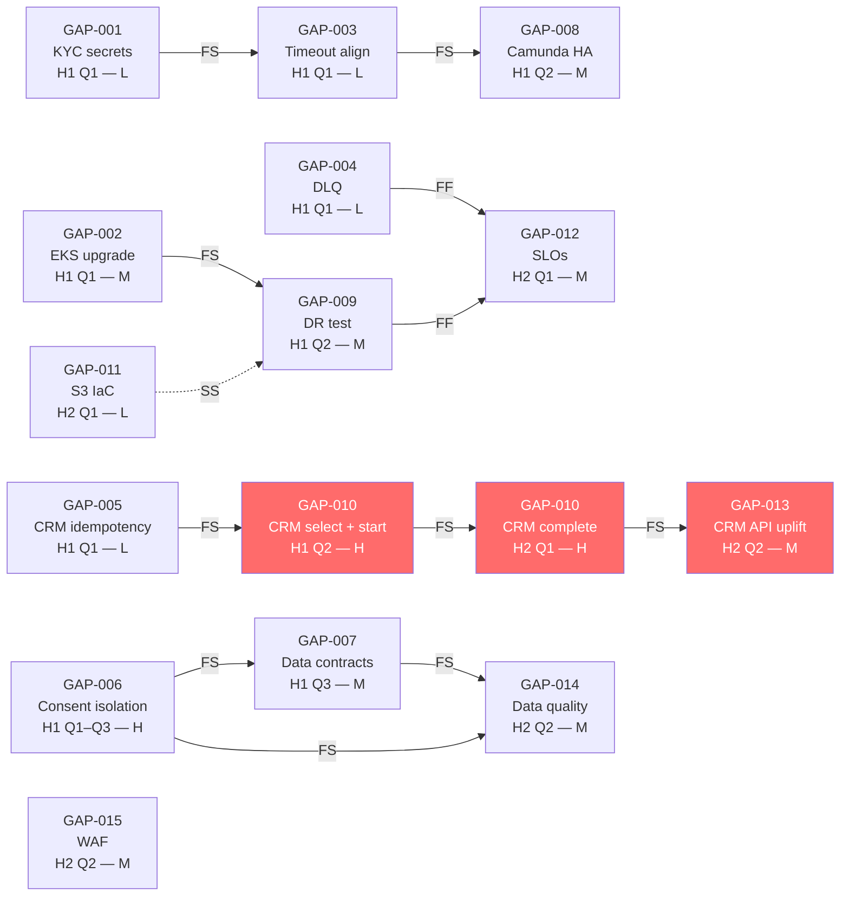

# Phase F Migration Plan — ACME Corp Customer Onboarding

**Engagement:** ACME Corp Customer Onboarding Modernisation — Phase 1  
**Lead Architect:** Marcus Webb, Head of Enterprise Architecture  
**Architecture Sponsor:** Sarah Chen, Chief Customer Officer  
**Source:** Gap analysis — 15 gaps across 7 domains (see `51.01-gap-analysis.md`)  
**Business target:** Reduce average onboarding cycle 11 days → ≤3 days  
**Hard constraint:** €12M capex ceiling over 3 years; regulatory data-protection compliance at all times  
**Planning horizon:** H1–H2 (Target); H3 (Partner API Platform, separate ADM cycle — CR-2025-008)

---

> [!abstract]
> Three-wave strangler-fig migration. H1 (0–12 months) achieves Platform Safety — no new volume added until five P1 gaps are closed and DR is validated. H2 (12–24 months) delivers the ≤3-day cycle business target by completing CRM replacement, SLO instrumentation, and data quality controls. H3 (24+ months) is the Partner API Platform — a separate ADM cycle (CR-2025-008) gated on H2 completion. Critical path runs through CRM replacement (GAP-010): 18–20 months end-to-end. Primary risk: CRM vendor selection slipping past H1 Q1 delays H2 delivery by a full quarter and pushes the business target into H3.

---

## Migration Overview

Two delivery waves (H1 + H2) across 24 months achieve the Customer Onboarding modernisation target. H1 establishes a production-safe platform by closing all five P1 security and reliability gaps, hardening the DR posture, and starting the CRM replacement in parallel. H2 completes the CRM migration, instruments full observability, and delivers the ≤3-day cycle to Sarah Chen's CCO commitment. The CRM strangler-fig begins in H1 Q2 — new onboarding cases route to the new SaaS CRM while legacy cases complete on the old system; the legacy system is decommissioned when the new CRM has processed 90 days of production volume without incident. H3 (Partner API Platform) is contingent on H2 completion and is governed by a separate Architecture Contract and ADM cycle.

---

## Migration Pattern

**Chosen pattern:** Phased cutover for security/reliability gaps (GAP-001 through GAP-009) + Strangler-fig for CRM replacement (GAP-010)

**Rationale:**
- Security and reliability gaps (GAP-001–009) are configuration and infra changes — each can be deployed, validated, and rolled back independently. Phased cutover with per-change smoke tests is low risk and maintains full production stability throughout H1.
- CRM replacement (GAP-010) involves live customer data migration, a parallel run period, and a traffic routing layer. Strangler-fig is the only viable pattern: a big-bang CRM cutover on an onboarding platform with 11-day average cycles would require a maintenance window longer than the cycle time itself, blocking new customer acquisition.

**Exit from transition state:** Migration is complete when: legacy CRM is decommissioned (zero production reads); ≤3-day cycle achieved for ≥90 consecutive days; all SLOs met for ≥30 days; DR test passed post-migration.

**Reversibility:** H1 individual gap fixes are **two-way door** until GAP-006 (consent isolation — one-way door after DPO sign-off). CRM strangler-fig routing is **two-way door** until legacy CRM is decommissioned — traffic can be re-routed to the old CRM if the new CRM fails during the parallel run. CRM decommission is a **one-way door**.

---

## 6Rs Workload Disposition

| Workload | 6R decision | Rationale | Effort | Business value unlocked | Confidence |
|---------|------------|-----------|--------|------------------------|------------|
| Legacy CRM Module (Salesforce v2019) | **Repurchase** | Vendor EOL; API Level 1 blocks integration; SaaS CRM eliminates hosting and patching overhead; commodity function | H | Removes the primary cause of the 11-day cycle (manual CRM data entry); enables ≤3-day target | working hypothesis |
| KYC Service | **Replatform** | Same vendor; change deployment to HA active-passive; rotate secrets to Secrets Manager; align timeout budget | M | Eliminates Critical security anti-pattern; removes most frequent production failure mode | informed estimate |
| Camunda BPM | **Replatform** | Same product; configure active-passive HA; align timeout; no code change | M | Eliminates single point of failure in orchestration tier | informed estimate |
| S3 Document Store | **Retain** + IaC uplift | No functional change; add Terraform management for drift prevention; no migration required | L | Eliminates configuration drift risk; DR documentation becomes accurate | proven |
| Notification Service (SQS) | **Replatform** | Add DLQ; no queue migration required; configuration-only change | L | Eliminates silent message loss; enables SLO measurement on notification delivery | proven |
| Customer Master DB | **Retain** + schema extension | No platform change; extract consent fields to new isolated schema; add data quality checks | H | Closes GDPR Art. 7 breach; enables data contract enforcement | working hypothesis |
| Identity Store (LDAP) | **Retain** (H1–H2) | Out of scope for Phase 1; flag for H3 assessment if Partner API Platform requires OIDC | — | Out of scope — carry to H3 assessment | working hypothesis |

---

## Dependency DAG

*Critical path (red): GAP-005 → GAP-010 (start) → GAP-010 (complete) → GAP-013*

---

## Phased Delivery Roadmap

### H1 (now → 12 months) — Platform Safety

**Sponsor (executive role):** Sarah Chen, Chief Customer Officer  
**Theme:** Make the platform production-safe before adding volume. Five P1 gaps close in H1 Q1 (security, reliability). Consent isolation and CRM selection run in parallel through H1 Q2–Q3.

| Item | 6R | Effort | Business Value | Hard Dependencies | Risk | Reversibility | Owner (role) | Confidence |
|------|----|----|---------------|-------------------|------|---------------|--------------|------------|
| GAP-004 — DLQ on notification queue | Replatform | L | Med — eliminates silent notification loss | none | L | two-way | Marcus Webb | proven |
| GAP-001 — KYC secrets manager | Replatform | L | High — eliminates Critical security anti-pattern | none | L | two-way | Priya Sharma | informed |
| GAP-002 — EKS 1.28 → 1.29 upgrade | Replatform | M | Med — eliminates active EOL compliance risk | none | M | two-way | Marcus Webb | proven |
| GAP-003 — BPM–KYC timeout alignment | Replatform | L | High — eliminates most frequent production failure | GAP-001 | L | two-way | Priya Sharma | informed |
| GAP-005 — CRM write idempotency key | Replatform | L | Med — prevents duplicate records on retry | none | L | two-way | Tom Hayward | informed |
| GAP-006 — Consent record isolation | Retain + schema | H | High — closes GDPR Art. 7 compliance breach | none | H | one-way | David Okafor | working hypothesis |
| GAP-008 — Camunda HA (active-passive) | Replatform | M | High — eliminates BPM single point of failure | GAP-003 | M | two-way | Marcus Webb | informed |
| GAP-009 — DR test and documentation | Replatform | M | High — validates RTO/RPO before volume increase | GAP-002 | M | two-way | Marcus Webb | informed |
| GAP-007 — Data contracts DC-001–003 | Retain + tooling | M | Med — prevents undetected schema breakage | GAP-006 | M | two-way | Priya Sharma | informed |
| GAP-010 — CRM: vendor select + parallel run start | Repurchase | H | High — critical path to ≤3-day cycle | GAP-005 | H | two-way (until decommission) | Tom Hayward | working hypothesis |

### H2 (12–24 months) — Business Outcome Delivery

**Sponsor (executive role):** Sarah Chen, Chief Customer Officer

**H2 trigger:** H1 gate review passed — all P1 gaps confirmed closed; DR test documented; CRM parallel run stable ≥30 days with zero data-loss incidents; DPO sign-off on consent isolation

| Item | 6R | Effort | Business Value | Hard Dependencies | Risk | Reversibility | Owner (role) | Confidence |
|------|----|----|---------------|-------------------|------|---------------|--------------|------------|
| GAP-010 — CRM: legacy decommission | Repurchase | H | High — completes onboarding cycle reduction; eliminates legacy maintenance cost | H1 parallel run stable | H | one-way | Tom Hayward | working hypothesis |
| GAP-011 — S3 IaC (Terraform) | Retain | L | Low — eliminates configuration drift risk | none | L | two-way | Marcus Webb | informed |
| GAP-012 — SLOs and burn-rate alerts | Replatform | M | High — establishes baseline for SLA commitments and partner API contracts | GAP-004, GAP-009 | M | two-way | Priya Sharma | informed |
| GAP-013 — CRM API Level 2+ | Repurchase | M | High — enables reliable programmatic integration and future Partner API | GAP-010 complete | M | two-way | Tom Hayward | informed |
| GAP-014 — Data quality monitoring | Retain + tooling | M | Med — reduces onboarding failure rate driven by data defects | GAP-006, GAP-007 | M | two-way | Priya Sharma | informed |
| GAP-015 — WAF and rate limiting | Replatform | M | Med — security hardening required before external exposure | none | M | two-way | David Okafor | informed |

### H3 (24+ months) — Partner API Platform

**Sponsor (executive role):** Sarah Chen, Chief Customer Officer

**H3 trigger:** H2 gate review passed; ≤3-day cycle achieved for ≥90 days; SLOs met for ≥30 days; CISO signed off on WAF; new ADM cycle authorised by Architecture Board (CR-2025-008)

| Item | 6R | Effort | Business Value | Hard Dependencies | Risk | Reversibility | Owner (role) | Confidence |
|------|----|----|---------------|-------------------|------|---------------|--------------|------------|
| CR-2025-008 — Partner API Platform | Refactor | H | High — new revenue stream; 3 distribution partners in LOI | All H2 gates + GDPR Art. 28 DPAs | H | one-way | Marcus Webb | working hypothesis |

---

## Critical Path

**GAP-005 → GAP-010 (vendor select, H1 Q2) → GAP-010 (parallel run, H1 Q2–H2 Q1) → GAP-010 (decommission, H2 Q1) → GAP-013 (API uplift, H2 Q2)**

Estimated duration: 18–20 months [informed estimate].

**What must not slip:** GAP-010 vendor selection. If selection is not completed by H1 Q1 month 3, the parallel run cannot begin by H1 Q2, and the legacy CRM cannot be decommissioned within H2. This pushes the ≤3-day cycle target into H3 and delays the Partner API Platform by at least one quarter. Tom Hayward (Customer Ops Director) owns the vendor selection decision; Architecture Sponsor sign-off is required before procurement begins.

---

## Quick Wins

**GAP-004 — DLQ on SQS (2 days):** Zero code change, infrastructure-only, eliminates the silent notification loss anti-pattern detected in Phase C. Ship on day 1 to demonstrate Platform Safety momentum to the Architecture Sponsor.

**GAP-001 — KYC secrets manager (1 week):** Rotates the Critical security anti-pattern. Immediate risk reduction; no production impact during rotation if the rollout uses a dual-key grace period.

**GAP-003 — BPM–KYC timeout (1 week):** Config change in Camunda; eliminates the most frequently triggered production failure detected in Phase C integration review. Unblocks GAP-008 (Camunda HA).

> [!tip]
> GAP-001 and GAP-003 can be deployed as a single change set — rotate the KYC API key (GAP-001) and update the BPM timeout (GAP-003) in the same deployment window. The secrets manager rotation and the timeout config change are independent of each other; a single deployment window reduces production change frequency and reduces on-call risk.

---

## Go / No-Go Gate Criteria

| Wave | Criterion | Verification method | Owner (role) | Gate verdict |
|------|-----------|---------------------|--------------|--------------|
| H1 | All five P1 gaps (GAP-001 through GAP-009) confirmed closed | JIRA tickets Done; verification criterion met per gap table | Marcus Webb | Go / No-Go |
| H1 | DR test completed and RTO ≤4h achieved in production-equivalent environment | DR runbook execution report, signed by Marcus Webb | Marcus Webb | Go / No-Go |
| H1 | Consent isolation DPO sign-off received | Written confirmation from DPO | David Okafor | Go / No-Go |
| H1 | CRM parallel run live for ≥30 days with zero data-loss incidents | Incident log; data reconciliation report | Tom Hayward | Go / No-Go |
| H2 | Legacy CRM decommissioned; all records in new CRM; data reconciliation report signed | Data migration report; zero reads against old CRM for 30 days | Tom Hayward | Go / No-Go |
| H2 | ≤3-day onboarding cycle achieved and stable for ≥60 days | Business metric dashboard (Tom Hayward); Ops report | Sarah Chen | Go / No-Go |
| H2 | SLOs met for all four services for ≥30 days | Grafana SLO dashboard; error budget >20% remaining | Priya Sharma | Go / No-Go |
| H2 | DR re-tested post-CRM migration; RTO ≤4h reconfirmed | DR runbook execution report (post-H2 migration) | Marcus Webb | Go / No-Go |

> [!important]
> The H2 "≤3-day cycle stable for ≥60 days" criterion is a named metric — it cannot be overridden by management judgement. The Architecture Sponsor approved this criterion at the start of Phase F. Any request to proceed to H3 before this criterion is met must be escalated to the Architecture Board as a dispensation request.

---

## Rollback Playbook

| Wave | Rollback trigger | Rollback steps | Time-to-rollback | Validation criteria | Owner (role) | Last tested |
|------|-----------------|----------------|-----------------|---------------------|--------------|-------------|
| H1 — GAP-001 KYC secrets | KYC pod fails to start; secret fetch times out for >5 min | (1) Re-add API key as temporary ConfigMap entry; (2) restart KYC pods; (3) confirm KYC health probe green | 15 min | KYC service responding within 2 min of rollback start | Priya Sharma | Not yet — test in staging before production deploy |
| H1 — GAP-002 EKS upgrade | Node group fails rolling update; >2 pods fail to schedule | (1) Roll back node group AMI to previous version via AWS console; (2) confirm all pods rescheduled | 30 min | All production pods running; no PodPending for >5 min | Marcus Webb | Not yet |
| H1 — GAP-010 CRM strangler-fig | New CRM returns >1% error rate sustained for >15 min | (1) Update BPM routing config to send all new cases to legacy CRM; (2) notify Tom Hayward; (3) open incident | 10 min | New case creation routing confirmed in BPM audit log | Tom Hayward | Not yet — test with synthetic traffic before go-live |
| H2 — GAP-010 CRM decommission | Data reconciliation finds >0.01% discrepancy in migrated records | (1) Halt decommission; (2) restore legacy CRM from snapshot; (3) re-route traffic to legacy; (4) run data audit | 2h | Record count and field-level reconciliation report shows zero discrepancy | Tom Hayward | Not yet |

> [!warning]
> The H2 CRM decommission rollback requires a legacy CRM snapshot taken within 24h of the decommission decision. If no current snapshot exists, rollback time increases from 2h to 8–24h depending on recovery from the most recent DR backup. The go/no-go gate for CRM decommission must include confirmation that a fresh snapshot was taken within the preceding 24h.

---

## Operational Readiness Checklist

| Item | H1 ready? | H2 ready? | Owner (role) |
|------|-----------|-----------|-------------|
| Runbooks written and reviewed for all changed components | No — draft by H1 Q2 | Yes | Marcus Webb |
| Monitoring dashboards configured for BPM, KYC, CRM, Notification | No — in progress | Yes (SLOs live) | Priya Sharma |
| On-call roster updated for new CRM and SQS DLQ alerts | No — update by H1 Q2 | Yes | Marcus Webb |
| Security review complete (secrets rotation, EKS upgrade) | No — H1 Q1 deliverable | Yes | David Okafor |
| Disaster recovery test executed (post-EKS upgrade) | No — H1 Q2 gate | Yes (post-CRM migration) | Marcus Webb |
| Data migration validation complete (CRM records) | N/A | Yes — pre-gate | Tom Hayward |
| User acceptance testing signed off (new CRM onboarding flows) | No — H1 Q3 (parallel run) | Yes — H2 Q1 | Tom Hayward |
| GDPR Art. 7 DPO sign-off on consent isolation | No — H1 Q3 gate | Yes | David Okafor |

---

## Migration Risks

| # | Assumption | Failure scenario | Probability | Impact | Mitigation | Owner (role) | Review trigger |
|---|------------|------------------|-------------|--------|------------|--------------|----------------|
| 1 | CRM vendor selection completes by H1 Q1 month 3 | Selection slips to H1 Q2; parallel run cannot begin on schedule; ≤3-day cycle pushed to H3 | M | H | Start RFP immediately (week 1); Architecture Sponsor pre-approves shortlist of 3 vendors; procurement fast-track approved | Tom Hayward | Re-assess if vendor shortlist not agreed by H1 month 6 |
| 2 | KYC vendor accepts timeout SLA extension (45s → 60s buffer) without contract renegotiation | Contract amendment required; GAP-003 and GAP-008 slip 4–6 weeks | L | M | Engage KYC vendor account manager in H1 Q1 week 1; document SLA in vendor contract before GAP-003 is deployed | Priya Sharma | Re-assess if vendor requests formal change notice |
| 3 | Customer Master DB schema permits consent field extraction without a full table migration | Schema coupling requires full migration; GAP-006 effort grows from H to XL; slips to H2 | M | H | Spike (1 week) in H1 Q1 to confirm schema isolation feasibility before committing to H1 Q1–Q3 timeline | David Okafor | Re-assess after spike result — if full migration required, escalate to Architecture Sponsor immediately |
| 4 | CRM data migration quality is sufficient for go-live (zero data-loss, <0.01% field discrepancy) | Migration defects require re-migration; H2 delivery delayed by 4–8 weeks | M | H | Run incremental data reconciliation checks throughout the parallel run; do not wait for decommission gate to discover discrepancies | Tom Hayward | Re-assess if reconciliation error rate exceeds 0.001% during parallel run |
| 5 | Team capacity is sufficient to run H1 security/reliability fixes and CRM selection in parallel | Capacity constraint forces serialisation; CRM selection delayed by 2–3 months | M | M | Confirm team capacity allocation in week 1; if insufficient, escalate to Architecture Sponsor for contractor augmentation | Marcus Webb | Re-assess at end of H1 Q1 sprint retrospective |

---

## Transition State Risk

During H1, the platform operates in a partially-hardened state: some P1 gaps are closed (DLQ, secrets, timeout), but the legacy CRM and single-node Camunda are still in production until H1 Q2. The team must monitor both legacy and new components throughout the transition — the observability burden is higher during this period than at steady state. The specific risk is that a production incident during H1 Q2 (when both the EKS upgrade and Camunda HA change are in flight) could require simultaneous rollback of multiple components, compounding the on-call burden. Mitigation: deploy EKS upgrade (GAP-002) and Camunda HA (GAP-008) in separate 1-week deployment windows, not simultaneously.

---

## TOGAF Transition Architectures

| State | Wave | Phase E/F reference | Capabilities delivered | Deployable as a coherent state? |
|-------|------|--------------------|-----------------------|--------------------------------|
| T1 | H1 complete | Phase E — security and reliability work packages (GAP-001–009) | Platform Safety: secrets managed, EKS supported, DR validated, integration anti-patterns resolved, consent GDPR-compliant, data contracts enforced. CRM parallel run live. Onboarding cycle still 11 days on legacy path | Yes — T1 is a coherent production state; all P1 gaps closed; CRM parallel run in progress |
| T2 | H2 complete | Phase F — CRM replacement work package (GAP-010–015) | Business Target: legacy CRM decommissioned; ≤3-day cycle achieved; SLOs instrumented; data quality monitoring active; WAF live. Platform ready for Partner API exposure | Yes — T2 is the target state for Phase 1; all 15 gaps closed; business target met |
| Target | H3 (new ADM cycle) | CR-2025-008 — separate Statement of Architecture Work | Partner API Platform: white-label onboarding API; multi-tenancy; 3 distribution partners; GDPR Art. 28 DPAs; new Architecture Contracts per partner | Yes — contingent on H2 T2 gate approval and new ADM cycle authorisation |

---

## Disruptive Alternative

The current plan sequences platform safety fixes before the CRM migration. An alternative: **data-first migration**. Migrate the Customer Master DB and Consent Store to a modern data platform first (H1), then build the application layer (BPM, KYC, notifications) against the new data model (H2). This eliminates the risk of discovering the CRM data model is incompatible with the target architecture mid-migration — a known failure mode in strangler-fig CRM migrations. The trade-off: all application teams are blocked on data migration completion in H1, increasing the H1 critical path risk and requiring more data engineering capacity upfront. Viable if ACME has a strong data engineering team; not viable if data engineering is the team's weakest capability. Confidence: working hypothesis — requires a team capacity assessment before committing.

---

## Second-Order Effect

The CRM strangler-fig pattern (routing new cases to the new CRM while legacy cases complete) creates a 3–6 month window during which the onboarding reporting team must maintain dashboards that span both systems simultaneously. The 11-day cycle metric cannot be measured cleanly during this window because some cases are in the legacy system (11-day profile) and some are in the new system (expected ≤3-day profile). Business reporting will show a blended metric that understates the improvement and may create confusion at the Architecture Sponsor level. Define a separate "new CRM path" metric from the first day of parallel run so the improvement is visible before the legacy CRM is decommissioned.

---

## Broad Responsibility

Customers whose onboarding is in-flight during the CRM parallel run period have their data processed in two systems simultaneously. GDPR Art. 5(1)(c) (data minimisation) and Art. 5(1)(f) (integrity and confidentiality) apply to this dual-processing window. The DPO must assess whether the parallel run period requires a supplementary privacy notice or an updated Record of Processing Activities (RoPA). This is not a deferred obligation — it must be confirmed before the parallel run begins, not when it ends.

---

## Standards Bar

Does this meet the bar for a client deliverable? Yes — this output: (1) defines a named migration pattern (strangler-fig for CRM, phased cutover for security/reliability) with rationale; (2) applies 6Rs to all seven workloads; (3) sequences all 15 gaps across H1 and H2 with hard dependencies, effort, risk, reversibility, owner, and confidence per item; (4) identifies the critical path (GAP-005 → GAP-010 → GAP-013, 18–20 months) and names the single item that cannot slip; (5) provides per-wave go/no-go gate criteria with named metrics (not management judgement); (6) provides rollback playbooks for four high-risk changes; (7) defines three TOGAF Transition Architectures (T1, T2, Target); and (8) names the second-order effect of the strangler-fig pattern on business reporting. A delivery team and Architecture Board can act on this output immediately.
