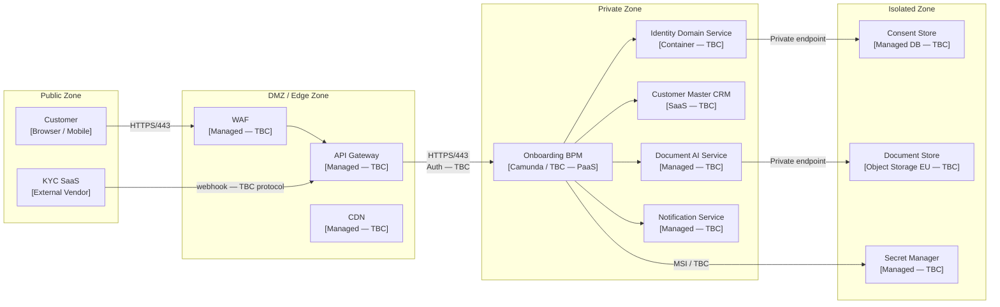

# Phase D Technology Architecture — Scaffold

**Engagement:** ACME Corp Customer Onboarding Modernisation — Phase 1
**Document type:** Phase D — Technology Architecture Definition Document section
**Status:** SCAFFOLD — not yet populated
**Author:** [Marcus Webb, Head of Enterprise Architecture]
**Version:** 0.1-draft
**Created:** 2025-10-28
**Produced by:** `/new-arch-doc Phase D`

---

> [!info]
> This document is a scaffold generated by `/new-arch-doc Phase D`. It contains all required TOGAF Phase D sections with guiding questions specific to the ACME engagement. It is not yet populated. The lead architect (Marcus Webb) must answer each guiding question before the corresponding section can be written. When ready to populate the main assessment, invoke `/technology-architecture` with this document as context. Invoke `/artifact-completeness` before Architecture Board submission to confirm all required catalogs, matrices, and diagrams are present.

---

```yaml
---
title: ACME Corp Customer Onboarding Modernisation — Technology Architecture ADD
created: 2025-10-28
status: Draft
phase: D
lead_architect: Marcus Webb — Head of Enterprise Architecture
stakeholders: Sarah Chen (CCO), Tom Hayward (Customer Ops Director), Priya Sharma (Identity Architect), David Okafor (CISO)
horizon: [H1 / H2 / H3 — to be confirmed]
tags: []
---
```

> [!abstract]
> *[3–5 sentences: what technology choices this Phase D makes, what infrastructure ambition it encodes, and what the unit economics look like at scale. Recommendation first. Example framing: "Phase D adopts a managed-services-first technology architecture on AWS eu-west-1, with no custom-built components where a utility-tier managed service exists. The target infrastructure reduces ACME's operational surface from N servers to M managed services, with projected steady-state cloud spend of €X/month at 500 onboardings/day. The legacy CRM infrastructure is decommissioned by Q4 2025 (constraint C-05), requiring a parallel-run period from [date] to [date]."]*

---

## 1. Baseline Technology Architecture

> [!important]
> *So what? Every technology component description must name the business risk or technical debt it creates — not just describe what it is. Apply a confidence marker (`[proven]` / `[informed estimate]` / `[working hypothesis]`) to every claim about the current state.*

*What technology stack, platforms, and infrastructure exist today? What is approaching end-of-life? What is locked-in? Where is the technical debt concentration?*

*Apply the commoditisation curve: genesis / custom-built / product / utility. Flag anything being maintained as custom-built that has drifted to product or utility.*

**Guiding questions to answer before writing this section:**

1. What are the four legacy CRM systems that currently host onboarding data? (vendor, version, hosting model — on-prem / private cloud / co-lo)
2. Which of those CRM systems is reaching end-of-life in Q4 2025 (constraint C-05)? Is it one system or more than one?
3. What is the current identity verification service — is it an internal tool or a third-party SaaS? What is its hosting model?
4. What is the current document capture service? Where does it run? What data classification does it handle?
5. What is ACME's current cloud platform? (The Technology Standards Register v4.2 mandates ACME's approved cloud platform per constraint C-03 — what does it name?)
6. Where is the technical debt concentration? (e.g., custom integration scripts, unsupported OS versions, deprecated runtimes)
7. What technology is end-of-life or approaching it beyond the Q4 2025 CRM (e.g., OS versions, middleware, TLS versions)?
8. What is the current network perimeter model — on-premises firewall, cloud VPC, or hybrid? Who owns it?

---

## 2. Target Technology Architecture

*What must the target technology architecture look like for Phase C designs to be implemented and operated reliably?*

*Disruptive alternative: what would a cloud-native, AI-native, or open-source version of this architecture look like? Why might the current direction create lock-in that costs more to exit than to avoid?*

**Target state summary:** [2–3 sentences — infrastructure and operations focused]

**Horizon:** H1 / H2 / H3 *(See Section 1 guiding question above. If the target is delivering the 11-day → 3-day reduction as the primary outcome, this is H1/H2. If it requires a new AI-driven onboarding capability that replaces manual steps entirely, name it H3.)*

**Guiding questions to answer before writing this section:**

1. Is ACME's approved cloud platform AWS, Azure, or GCP? What region is mandated for data residency? (The Phase C Data Architecture review confirmed EU residency — is eu-west-1 the specific target?)
2. What is the target compute model for the onboarding platform — containers (ECS/EKS/AKS), serverless (Lambda/Functions), or PaaS (Elastic Beanstalk/App Service)? Has this been decided or is it open?
3. What is the target orchestration model for the onboarding workflow — Camunda BPM (referenced in Phase C), AWS Step Functions, or something else? Is this a one-way door if BPM tooling is already contractually engaged?
4. What is the KYC SaaS provider being selected? Does it have a managed integration path (webhook, event bus) or does it require a custom adapter?
5. What is the target operating model for the platform — do ACME's platform engineers (currently ~4) own the infrastructure, or is a managed cloud operations service in scope?
6. What does the disruptive alternative look like for ACME specifically — e.g., could a no-code identity orchestration platform (e.g., Auth0/Okta Workflows) replace the BPM engine and the identity verification service as separate components?

### Deployment Topology

> [!info]
> *Cross-reference: the Phase C Application Architecture defines the logical application components that must be hosted in this topology. Pull the Phase C Application Architecture ADD (or invoke `/integration-architecture`) to confirm which components need a technology home before drawing this diagram.*

*[Mermaid flowchart — actor channels → security zones → infrastructure components. Show zone boundaries as subgraphs. Use PaaS/SaaS/Managed/IaaS labels per component. Show ACME's four security zones: Public, DMZ/Edge, Private, Isolated. The Consent Store must be in the Isolated zone — see Phase C Data Architecture.]*


*Target deployment topology — SCAFFOLD. Replace [TBC] labels once technology decisions are made. Confirm zone membership with David Okafor (CISO) before Phase D sign-off.*

**Guiding questions to answer before finalising this diagram:**

1. Does ACME use four named security zones (Public, DMZ, Private, Isolated) or a different zone model? Check with David Okafor (CISO).
2. What API Gateway is in scope — AWS API Gateway, Azure APIM, Kong, or another? This is a one-way door if ACME's Technology Standards Register mandates a specific product.
3. What is the authentication mechanism between the DMZ and the Private zone — OAuth2 bearer token, mTLS, managed identity, or API key? This must align with Principle T-02 (security at every layer).
4. Where does the KYC SaaS webhook land — directly at the API Gateway, or via a dedicated inbound integration endpoint?
5. Is the Camunda BPM deployment containerised (on Kubernetes) or a managed PaaS? What does Priya Sharma's Phase C Application Architecture specify?

---

## 3. Technology Standards Catalog

*What technology standards apply to each architectural layer? These are the decisions that constrain Phase C implementation choices.*

*Cross-reference: ACME Technology Standards Register v4.2 (referenced in constraint C-03). Pull this document — it defines the approved technology list. Every row in this table must cite the register or identify a gap where no standard exists.*

| Layer | Standard technology | Rationale | Commoditisation level | Confidence |
|-------|--------------------|-----------|-----------------------|------------|
| API Gateway | *[technology — check Standards Register v4.2]* | *[why this standard]* | *Genesis / Custom / Product / Utility* | *proven / informed / hypothesis* |
| Identity / Auth (CIAM) | *[technology — Priya Sharma to confirm]* | *[rationale]* | *[level]* | *[confidence]* |
| Workflow / BPM | *[Camunda or alternative — decision pending]* | *[rationale]* | *[level]* | *[confidence]* |
| Container orchestration | *[technology — check Standards Register]* | *[rationale]* | *[level]* | *[confidence]* |
| Observability | *[technology — this is a gap from Phase C Data Architecture: no observability stack defined]* | *[rationale]* | *[level]* | *[confidence]* |
| Data storage — operational | *[PostgreSQL confirmed in Phase C — what managed offer?]* | *[rationale]* | *[level]* | *[confidence]* |
| Data storage — documents | *[S3 EU confirmed in Phase C — what specific bucket config?]* | *[rationale]* | *[level]* | *[confidence]* |
| Secret management | *[technology]* | *[rationale]* | *[level]* | *[confidence]* |
| CI/CD | *[technology — check Standards Register]* | *[rationale]* | *[level]* | *[confidence]* |
| KYC SaaS | *[vendor — selection in progress per SoAW]* | *[rationale]* | *Utility — commodity identity verification* | *[confidence]* |

> [!tip]
> *The observability layer is unresolved as of Phase C — the Data Architecture review (GAP-DA06) identified "no data quality monitoring in place" and noted the Phase D observability stack must be defined before data quality SLAs can be measured. Resolve this row before presenting the Phase D ADD to the Architecture Board. Commodity options: AWS CloudWatch + OpenTelemetry, Datadog (SaaS), Grafana Cloud.*

**Guiding questions to answer before writing this section:**

1. What does ACME's Technology Standards Register v4.2 specify for each layer? Pull this document now — do not invent standards.
2. Is the KYC SaaS vendor selected? If not, this row is a gap that blocks the Network Flow Matrix (Section 6) and the Lock-in Register (Section 8).
3. Is the BPM tooling (Camunda) already contractually engaged or is it still a candidate? If contractually engaged, it is a one-way door — flag it in the Lock-in Register.
4. What observability tooling is currently used by ACME's platform engineering team? Is there an existing standard, or is this a greenfield decision?

---

## 4. Module-to-Infrastructure Traceability

*Every logical module from Phase C must map to a technology product, infrastructure offer, and security zone. Gaps in this table = Phase C modules without a technology home.*

*Cross-reference: pull the Phase C Application Architecture ADD to get the definitive list of application components. If it is not yet complete, invoke `/integration-architecture` to produce the application topology first.*

| Phase C module | Technology product | Infrastructure offer | Zone | Scaling model | Owner (role) |
|---------------|-------------------|--------------------|------|--------------|-------------|
| Customer-facing channel (web/mobile) | *[CDN + WAF + TBC]* | *PaaS / Managed* | Public → DMZ | *Horizontal* | *[role — TBC]* |
| Onboarding BPM engine | *[Camunda / TBC]* | *PaaS / Container* | Private | *Horizontal* | *[role — TBC]* |
| Identity Domain Service | *[Container — TBC]* | *PaaS / IaaS* | Private | *Horizontal* | Priya Sharma (Identity Architect) |
| Customer Master CRM | *[SaaS CRM — TBC]* | *SaaS* | Private | *Managed by vendor* | Tom Hayward (Customer Ops Director) |
| Document AI Service | *[Managed AI service — TBC]* | *SaaS / Managed* | Private | *Managed by vendor* | *[role — TBC]* |
| Notification Service | *[Managed messaging — TBC]* | *SaaS / Managed* | Private | *Horizontal* | *[role — TBC]* |
| Consent Store | *[Managed DB — TBC]* | *Managed* | Isolated | *Vertical / Fixed* | David Okafor (CISO) |
| Document Store | *[Object Storage EU — S3 eu-west-1 / TBC]* | *Managed* | Isolated | *Horizontal* | *[role — TBC]* |
| Secret Manager | *[Managed — TBC]* | *Managed* | Isolated | *Fixed* | David Okafor (CISO) |

> [!warning]
> *The Document Capture and Onboarding Process State modules have no named owner in the Phase C Data Architecture RACI (GAP-DA02, GAP-DA03). Those ownership gaps must be resolved before this traceability table can be signed off — an infrastructure component without an application owner is a governance gap.*

**Guiding questions to answer before writing this section:**

1. Is the Phase C Application Architecture ADD complete? If not, which modules are still undefined?
2. Who is the named infrastructure owner for the Document AI Service and the Notification Service? Tom Hayward (Customer Ops Director) owns the customer-facing outcome — does he own the infrastructure, or does Platform Engineering?
3. Is the Consent Store a separate database instance or a schema within a shared database? (If shared, the zone isolation is weakened — the Phase C Data Architecture requires Isolated zone placement.)
4. Is the Document Store already provisioned in AWS S3 eu-west-1 (referenced in Phase C), or is it still to be provisioned?

---

## 5. Environments Matrix

*Every infrastructure service must be provisioned per environment. Gaps in this table = environments where services are missing or undefined.*

| Infrastructure service | Dev | Staging | Production | Notes |
|-----------------------|-----|---------|------------|-------|
| API Gateway | *[instance type / config]* | *[config]* | *[config]* | *[parity notes]* |
| Onboarding BPM engine | *[config]* | *[config]* | *[config]* | *[parity notes]* |
| Identity Domain Service | *[config]* | *[config]* | *[config]* | *[parity notes]* |
| Customer Master CRM | *[shared sandbox / dedicated]* | *[config]* | *[config]* | *SaaS — confirm vendor sandbox model with Priya Sharma* |
| Document AI Service | *[config]* | *[config]* | *[config]* | *[parity notes]* |
| Consent Store (Managed DB) | *[size / config]* | *[size / config]* | *[size / config]* | *Staging must enforce the same isolation boundary as production — not a shared instance* |
| Document Store (S3 EU) | *[bucket config]* | *[bucket config]* | *[bucket config]* | *[parity notes]* |
| Notification Service | *[config]* | *[config]* | *[config]* | *[parity notes]* |
| Secret Manager | *[config]* | *[config]* | *[config]* | *Staging and production must use separate key vaults — never shared* |
| Observability stack | *[config]* | *[config]* | *[config]* | *[parity notes — TBD pending observability standard selection]* |

> [!warning]
> *Flag any production service with no staging equivalent — this is a release risk. Flag any staging environment with significantly lower capacity than production — this masks performance issues. In particular: the Consent Store must have a staging equivalent with the same zone isolation, or consent separation cannot be integration-tested before go-live (GDPR compliance risk).*

**Guiding questions to answer before writing this section:**

1. Does ACME currently operate Dev / Staging / Production environments for cloud workloads, or is the environment model different (e.g., Dev / QA / UAT / Prod)?
2. Who is responsible for provisioning environments — Platform Engineering or a central cloud ops team?
3. Is there an infrastructure-as-code (IaC) standard? (e.g., Terraform, Pulumi, CDK) — if so, environments should be defined as IaC modules, not manual configs.
4. Are the KYC SaaS and Customer Master CRM vendors able to provide sandbox / staging tenants? If not, integration testing against production-equivalent configuration is not possible — flag as a risk.
5. Is there a known gap between staging and production capacity that currently masks performance issues?

---

## 6. Network Flow Matrix

*Every network path must be documented. This is the Architecture Contract for network security teams and infrastructure engineers. An undocumented network flow is either a security gap or a delivery surprise.*

*Cross-reference: data contracts DC-001 (KYC SaaS → Identity Domain), DC-002 (Document AI → Document Store), DC-003 (Customer Master → Consent Store) are defined in the Phase C Data Architecture. Their network paths must appear in this matrix.*

| Flow ID | Source | Target | Protocol / Port | Auth mechanism | Data classification | SLA (latency / availability) | Network element | Owner (role) |
|---------|--------|--------|----------------|---------------|--------------------|-----------------------------|----------------|-------------|
| N1 | Customer (browser/mobile) | API Gateway | HTTPS/443 | *[OAuth2 PKCE / TBC]* | Public | *[P99 ms / % uptime — TBC]* | WAF | *[role — TBC]* |
| N2 | API Gateway | Onboarding BPM engine | HTTPS/443 | *[mTLS / managed identity — TBC]* | Internal | *[P99 ms — TBC]* | *[NSG / Service Mesh — TBC]* | *[role — TBC]* |
| N3 | KYC SaaS (DC-001) | Identity Domain Service | HTTPS/443 | *[API key / HMAC webhook signature — TBC]* | Confidential | *Webhook delivery ≤30s; 99.5% (from DC-001)* | API Gateway inbound | Priya Sharma (Identity Architect) |
| N4 | Identity Domain Service | Consent Store | *[TCP/5432 or HTTPS — TBC]* | *[Private endpoint / managed identity — TBC]* | Restricted | *[P99 ms — TBC]* | *[Private endpoint — TBC]* | David Okafor (CISO) |
| N5 | Document AI Service (DC-002) | Document Store | *[HTTPS/443 — TBC]* | *[Managed identity / pre-signed URL — TBC]* | Confidential | *Delivery ≤60s (from DC-002)* | *[Private endpoint — TBC]* | *[role — TBC]* |
| N6 | Customer Master CRM (DC-003) | Consent Store | *[HTTPS/443 — TBC]* | *[Managed identity / TBC]* | Restricted | *Real-time sync on consent change (from DC-003)* | *[Private endpoint — TBC]* | David Okafor (CISO) |
| N7 | Onboarding BPM engine | Secret Manager | HTTPS/443 | *[MSI / TBC]* | Confidential | *[P99 ms — TBC]* | *[Private endpoint — TBC]* | *[role — TBC]* |
| N8 | *[All services]* | Observability / logging | *[TBC — HTTPS/443 typically]* | *[Managed identity — TBC]* | Internal | *[TBC]* | *[TBC]* | *[role — TBC]* |

*[Confidence per SLA: rows N3, N5, N6 inherit SLAs from Phase C data contracts (DC-001/002/003) — `[working hypothesis]` until load tested. Rows N1/N2 are `[working hypothesis]` — no load test conducted.]*

> [!important]
> *DC-001 (N3) is a one-way door risk: the KYC SaaS webhook authentication mechanism must be agreed with the vendor before the integration is designed. If the vendor does not support HMAC signatures or equivalent, a custom auth adapter is required — this is a delivery risk and a lock-in exposure. Flag in the Lock-in Register.*

**Guiding questions to answer before writing this section:**

1. What authentication mechanism does the KYC SaaS vendor support for its webhook (N3)? HMAC signature? API key? mTLS client certificate?
2. Does ACME mandate private endpoints for all communication between Private and Isolated zones (N4, N5, N6)? Check with David Okafor (CISO).
3. What are the SLA targets for customer-facing flows (N1)? The engagement goal is ≤3-day onboarding cycle — what does this imply for API Gateway latency and availability?
4. Are there any network flows to on-premises systems (e.g., legacy CRM during the parallel-run period)? If so, what is the connectivity model — VPN, Direct Connect, or ExpressRoute?
5. Is there a network path for the legacy CRM → new platform data migration? This is not a steady-state flow but must be documented for the migration phase.

---

## 7. HA / DR Strategy

*For each critical service: what is the availability target? What is the recovery strategy if it fails? Who executes the recovery?*

*The engagement target is ≤3-day onboarding cycle. A major infrastructure outage that halts onboarding for hours directly damages this target — RTO/RPO choices here are not technical decisions, they are business commitments.*

| Service | Availability target | RTO | RPO | Failover mechanism | Backup strategy | Recovery owner (role) |
|---------|--------------------|----|-----|-------------------|----------------|----------------------|
| API Gateway | *[% uptime SLA — TBC]* | *[time to restore]* | *N/A — stateless* | *Managed — auto* | *N/A — managed service* | *[role — TBC]* |
| Onboarding BPM engine | *[% uptime — TBC]* | *[RTO — TBC]* | *[RPO — TBC]* | *[Auto / Manual — TBC]* | *[backup type + frequency]* | *[role — TBC]* |
| Identity Domain Service | *[% uptime — TBC]* | *[RTO — TBC]* | *[RPO — TBC]* | *[Auto / Manual — TBC]* | *[backup type + frequency]* | Priya Sharma (Identity Architect) |
| Customer Master CRM (SaaS) | *[vendor SLA — pull from vendor contract]* | *[vendor RTO]* | *[vendor RPO]* | *Managed by vendor* | *Managed by vendor* | Tom Hayward (Customer Ops Director) |
| Consent Store | *[% uptime — TBC]* | *[RTO — TBC]* | *[RPO — TBC]* | *[Auto / Manual — TBC]* | *[backup type + frequency]* | David Okafor (CISO) |
| Document Store | *[% uptime — TBC]* | *N/A — object storage*| *[RPO — TBC]* | *[Cross-region replication — TBC]* | *[versioning + replication]* | *[role — TBC]* |
| KYC SaaS (external) | *[vendor SLA — pull from vendor contract]* | *[vendor RTO]* | *N/A — vendor-owned* | *[Vendor failover — confirm]* | *N/A — vendor-owned* | Priya Sharma (Identity Architect) |

> [!warning]
> *Flag any service with RTO or RPO = "unknown" — this is an operational gap. In particular: the Onboarding BPM engine is the critical path for the onboarding workflow. If it fails, all in-flight onboarding cases are blocked. Its RTO must be defined before Phase G go-live — an RTO of "unknown" on the critical path is not acceptable. Flag any service where failover is Manual with RTO < 1 hour — this requires runbook validation.*

**Guiding questions to answer before writing this section:**

1. What is ACME's business RTO/RPO requirement for the onboarding platform? Is there a Business Continuity Plan (BCP) that defines the maximum tolerable downtime for customer-facing services?
2. Does the Customer Master CRM SaaS vendor's contract specify an availability SLA? What is it? What is their RTO commitment for a full-service outage?
3. Does the KYC SaaS vendor's contract specify an availability SLA and failover commitments? If ACME cannot onboard customers because the KYC SaaS is down, is there a contractual remedy?
4. Is multi-region failover in scope for Phase 1 (H1), or is it a Phase 2 (H2) item? Multi-region adds material cost — confirm with Sarah Chen (CCO) whether the budget envelope covers this.
5. Who is the named recovery owner for each service — Platform Engineering, the named domain architect, or an external managed ops provider?
6. Is there a runbook requirement before go-live? Who owns runbook creation?

---

## 8. Lock-in Register

*Where are the hard technology dependencies? For each: is the lock-in intentional (strategic bet) or accidental (path dependency)? What is the exit strategy and its cost?*

*The Phase C Data Architecture noted the KYC SaaS integration (DC-001) as the most constrained edge. The lock-in register must reflect this — vendor contract terms govern schema change notice periods.*

| Component | Technology / Vendor | Lock-in type | Lock-in intentional? | Exit strategy | Exit cost estimate | Review trigger |
|-----------|--------------------|-----------|-----------------------|--------------|-------------------|----------------|
| KYC SaaS | *[vendor — TBC]* | API + Data + Contract | *[Yes / No — TBC]* | *[Replace with alternative KYC SaaS — estimated N-month migration]* | *[H/M/L — TBC]* | Vendor raises price > 30%; announces EOL; fails to meet SLA for 3 consecutive months |
| Customer Master CRM | *[SaaS CRM vendor — TBC]* | Data + API + Contract | *[Yes / No — TBC]* | *[Data export + migration to alternative CRM — estimated N months]* | *[H/M/L — TBC]* | Vendor raises price > 25%; EoL announcement; contract renewal |
| Cloud platform | *[AWS / Azure / GCP — TBC — constrained by Standards Register v4.2]* | Ecosystem + Managed services | Yes — strategic bet (Standards Register mandate) | Re-platform to alternative cloud — material effort | H | Standards Register revision; cloud platform commercial review |
| Onboarding BPM engine | *[Camunda / TBC]* | API + Skill + Contract | *[Yes / No — TBC: contractually engaged?]* | *[Replace with alternative BPM or serverless workflow — estimated N months]* | *[H/M/L — TBC]* | Camunda pricing model changes; vendor acquisition; alternative BPM reaches utility tier |
| Document AI Service | *[vendor — TBC]* | API + Data | *[TBC]* | *[Switch to alternative managed AI service]* | *[H/M/L — TBC]* | Vendor raises price > 20%; accuracy SLA breached |

> [!important]
> *Flag any lock-in rated "No — path dependency" where the exit cost is High — this is unintended lock-in that should be redesigned. In particular: if the KYC SaaS integration uses a proprietary data model that is not abstracted behind an ACME-owned interface, exit cost will be High and the lock-in is a path dependency. An abstraction layer (anti-corruption layer) should be evaluated — it is a two-way door investment that converts a one-way door dependency.*

**Guiding questions to answer before writing this section:**

1. Is the KYC SaaS vendor selected? If not, this row cannot be completed — and the lock-in register is a gate for Architecture Board review.
2. Is the BPM tooling (Camunda) contractually engaged? If yes, it is a one-way door — the exit cost and exit strategy must be documented.
3. Does the Technology Standards Register v4.2 mandate a specific cloud provider? If so, the cloud platform lock-in is intentional (Standards Register mandate) — flag it as a strategic bet, not a path dependency.
4. Is there an abstraction layer (e.g., anti-corruption layer, adapter interface) planned between ACME's onboarding domain and the KYC SaaS API? If not, recommend one — it converts a one-way door dependency into a two-way door.
5. Who owns the review trigger for each lock-in entry — i.e., who is responsible for monitoring the vendor relationship and escalating when the trigger event occurs?

---

## 9. Well-Architected Lens *(cloud platform in scope)*

*Map the relevant cloud provider's Well-Architected Framework pillars to the building blocks in this architecture. Identify gaps. Cross-reference: invoke `/technology-architecture` to run a full WAF assessment once the technology choices in Section 3 are confirmed.*

| WAF Pillar | Building block | Assessment | Gap / Action |
|-----------|---------------|------------|-------------|
| Reliability | Onboarding BPM engine | *Met / Partial / Gap — TBC* | *[if gap: what to add]* |
| Reliability | KYC SaaS integration (N3) | *Met / Partial / Gap — TBC* | *[Single point of failure if no retry / circuit breaker — TBC]* |
| Security | Consent Store (Isolated zone) | *Met / Partial / Gap — TBC* | *[Zone isolation confirmed? Encryption at rest and in transit?]* |
| Security | Customer Identity flow (N1 → N3) | *Met / Partial / Gap — TBC* | *[Auth mechanism confirmed with CISO?]* |
| Cost Optimisation | Cloud platform spend | *Met / Partial / Gap — TBC* | *[Unit economics at 500 onboardings/day vs. budget envelope?]* |
| Operational Excellence | Observability stack | *Gap — observability standard not yet selected (see Section 3)* | Resolve observability standard selection; define alerting thresholds per service |
| Performance Efficiency | API Gateway + BPM | *Met / Partial / Gap — TBC* | *[P99 latency target for N1 defined?]* |
| Sustainability | Cloud platform region | *Met / Partial / Gap — TBC* | *[AWS/Azure/GCP eu-west-1 sustainability commitments — confirm vendor carbon commitment]* |

**Guiding questions to answer before writing this section:**

1. Which cloud provider's WAF applies — AWS Well-Architected, Azure Well-Architected, or GCP Architecture Framework? (Depends on Standards Register v4.2 answer.)
2. Is there an existing WAF review for any current ACME workloads that can serve as a benchmark?
3. What is the unit cost model — estimated monthly cloud spend at the expected onboarding volume (≤500/day in H1)?
4. What sustainability commitments does the chosen cloud provider make for the target region? (ACME's Broad Responsibility line must address this — see Section 13.)

---

## 10. Gap Analysis (Technology Layer)

*Technology gaps must trace to either a Phase C gap (inherited) or a net-new technology gap identified in Phase D. Gaps from the Phase C Data Architecture (GAP-DA06 — no observability stack) must appear here with a Phase D owner.*

| Gap ID | Component / Service | As-Is | To-Be | Gap type | Priority | Reversibility | Owner (role) | Review trigger |
|--------|---------------------|-------|-------|----------|----------|---------------|--------------|----------------|
| GAP-D01 | Observability stack | No observability stack (inherited: GAP-DA06 from Phase C) | Managed observability platform with data quality monitoring | New | P1 | two-way door | *[role — TBC: Head EA or Platform Engineering]* | Before Phase G go-live — data quality SLAs cannot be measured without this |
| GAP-D02 | KYC SaaS integration auth (N3) | Auth mechanism unconfirmed with vendor | Confirmed auth mechanism + abstraction layer (anti-corruption layer) | New | P1 — integration gate | one-way door if no abstraction layer | Priya Sharma (Identity Architect) | Before KYC SaaS integration design begins |
| GAP-D03 | Environments matrix | No staging environment for cloud workloads (assumed) | Full Dev / Staging / Production environment matrix provisioned via IaC | New | P1 | two-way door | *[Platform Engineering — role TBC]* | Before integration testing begins |
| GAP-D04 | HA/DR — Onboarding BPM | RTO/RPO undefined | Defined RTO/RPO with tested runbook | Uplift | P1 | two-way door | *[role — TBC]* | Before Phase G go-live |
| GAP-D05 | Technology standards — Observability | No standard selected | Standard selected and entered in Technology Standards Register | New | P2 | two-way door | Marcus Webb (Head EA) | Before Phase D ADD is submitted to Architecture Board |
| GAP-D06 | Lock-in register — KYC SaaS | Vendor not yet selected | Vendor selected; lock-in register completed; anti-corruption layer decision made | New | P1 | two-way door (pre-selection) | Priya Sharma (Identity Architect) | Before Phase D ADD is submitted to Architecture Board |

**Guiding questions to answer before writing this section:**

1. Are there technology gaps beyond those inherited from Phase C? (Run the /technology-architecture skill against the target architecture to surface additional gaps.)
2. Who owns GAP-D01 (observability)? The Phase C Data Architecture named Marcus Webb (Head EA) as owner — does this carry forward to Phase D?
3. Is the IaC tooling standard already defined in the Technology Standards Register, or is this a net-new gap?
4. Are there any legacy infrastructure decommission gaps that need to be tracked here — e.g., the legacy CRM servers that must be decommissioned by Q4 2025 (constraint C-05)?

---

## 11. Risks & Assumptions

*Primary assumption + failure scenario. Second-order effect: what operational team or downstream system will be affected by technology choices made here?*

| Risk / Assumption | Type | Probability | Impact | Mitigation | Confidence | Owner (role) | Review trigger |
|-------------------|------|-------------|--------|------------|------------|--------------|----------------|
| KYC SaaS vendor not selected before Phase D sign-off — technology choices in Sections 3, 6, 8 remain open | Risk | M | H | Accelerate vendor selection; treat as go-no-go gate for Architecture Board Phase D review | [working hypothesis] | Priya Sharma (Identity Architect) | When vendor evaluation shortlist is complete |
| BPM tooling (Camunda) is not contractually engaged — deployment model and scaling approach are assumed | Assumption | — | M | Confirm contractual status; if not contracted, keep two-way door open by evaluating serverless workflow alternative | [working hypothesis] | Marcus Webb (Head EA) | When BPM tooling decision is confirmed |
| Staging environment parity with production is insufficient for Consent Store isolation — GDPR compliance test fails | Risk | M | H | Mandate staging isolation boundary mirrors production; validate with David Okafor (CISO) before integration testing | [informed estimate] | David Okafor (CISO) | Before integration testing begins |
| KYC SaaS vendor changes webhook schema without adequate notice (DC-001) — Identity Domain Service ingestion fails silently | Risk | M | H | Formalise DC-001 schema contract; implement schema registry; add circuit breaker on ingestion layer | [proven — Phase C Data Architecture finding] | Priya Sharma (Identity Architect) | Before KYC SaaS integration goes live |
| Cloud platform unit economics exceed budget envelope at H2 onboarding volumes | Risk | L | M | Model unit economics at 500/day and 2,000/day; review with Sarah Chen (CCO) before committing to managed service tier selections | [working hypothesis] | Marcus Webb (Head EA) | When cloud platform tier selections are made |

**Second-order effect:** *[Name one non-obvious downstream consequence — typically an operational burden on a team outside the design scope. Example: If the observability stack (GAP-D01) is not resolved before go-live, the Customer Operations team (Tom Hayward) will have no automated alerting for stalled onboarding cases — they will detect failures only when customers contact support. This converts a technology gap into a customer experience risk that lands in the Customer Ops team's incident queue, not the platform engineering team's.]*

**Guiding questions to answer before writing this section:**

1. What risks are specific to ACME's technology context that are not already captured in the Phase C Data Architecture risk register? (Run `/risk-radar` to surface the full set.)
2. What is the highest-probability technology risk that is not currently being mitigated — and why? Who owns it?
3. Is the assumption that ACME's platform engineering team (~4 engineers) can operate the target managed services estate valid? What is the operational loading at 500 onboardings/day?
4. What is the second-order effect of a KYC SaaS outage on the Customer Operations team? (Tom Hayward owns customer operations — has he been consulted on the HA/DR requirements?)

---

## 12. Decision Register

*Material technology decisions. Every decision must carry a confidence marker, reversibility tag, named owner, and review trigger — the author cannot omit these.*

| Decision | Confidence | Reversibility | Owner (role) | Review trigger |
|----------|------------|---------------|--------------|----------------|
| *[Cloud platform — adopt [AWS/Azure/GCP] as the sole approved platform for Phase D (mandated by Standards Register v4.2)]* | *proven / informed / hypothesis — TBC* | one-way door — platform migration is material effort | Marcus Webb (Head EA) | Standards Register revision; cloud platform commercial review |
| *[KYC SaaS vendor — select [vendor TBC] as the managed identity verification service]* | *[working hypothesis — vendor not yet selected]* | one-way door once contracted and integrated | Priya Sharma (Identity Architect) | Vendor evaluation complete; contract signed |
| *[BPM engine — adopt [Camunda / serverless / TBC] as the onboarding workflow orchestrator]* | *[working hypothesis — TBC]* | *[one-way / two-way — depends on contractual engagement]* | Marcus Webb (Head EA) | BPM tooling contractual status confirmed |
| *[Observability — adopt [tool TBC] as the standard observability platform]* | *[working hypothesis — standard not yet selected]* | two-way door — observability tooling is switchable | Marcus Webb (Head EA) | Observability standard selected and entered in Technology Standards Register |
| *[Anti-corruption layer — adopt an abstraction layer between ACME's domain and the KYC SaaS API]* | *[informed estimate — recommended; not yet confirmed]* | two-way door — can be added after initial integration | Priya Sharma (Identity Architect) | KYC SaaS vendor selected and API design confirmed |

**Guiding questions to answer before writing this section:**

1. Which of these decisions are already made (i.e., the answer is known from existing standards or contracts) versus still open?
2. Are there decisions that should be elevated to the Architecture Board before Phase D can be progressed — i.e., decisions that Marcus Webb cannot make alone?
3. Are there decisions with a "point of no return" approaching — where delaying costs more than deciding? (Flag as one-way doors that are about to close.)

---

## 13. Broad Responsibility

*One line per dimension: carbon footprint of infrastructure choices (compute / storage / networking) · regulatory residency obligations · vendor sustainability commitments · customers-of-customers experience during incidents. `N/A — [reason]` only if none plausibly applies.*

**Carbon footprint:** *[The target architecture runs on [cloud provider] [region]. [Cloud provider]'s sustainability commitment for [region] is [TBC — pull from vendor sustainability report]. All managed services are serverless-first where available, reducing idle compute. If ACME adopts a container-based model, right-sizing and auto-scaling policies must be defined to avoid idle resource waste. Owner: Marcus Webb (Head EA). Review trigger: annual cloud sustainability report.]*

**Regulatory residency:** *[All personal data (Customer Identity, Consent Records, Document Captures) is confirmed EU-resident (Phase C Data Architecture). The target infrastructure must enforce data residency at the storage layer — confirm that the chosen managed services do not replicate data outside the EU by default. Owner: David Okafor (CISO). Review trigger: before go-live; any cloud provider region expansion.]*

**Vendor sustainability:** *[The KYC SaaS vendor's sustainability commitments are unknown — pull vendor sustainability report during vendor evaluation. Add sustainability posture as an evaluation criterion. Owner: Priya Sharma (Identity Architect). Review trigger: vendor selection.]*

**Customers-of-customers:** *[ACME's customers include businesses that may themselves be onboarding their own end-customers using ACME services. A platform outage that halts ACME's onboarding capability propagates to a second tier of affected individuals (customers-of-customers) who have no direct relationship with ACME. The HA/DR strategy (Section 7) must account for this blast radius — RTO/RPO decisions are not purely ACME-internal. Owner: Tom Hayward (Customer Ops Director). Review trigger: HA/DR commitments confirmed with Architecture Board.]*

**Guiding questions to answer before writing this section:**

1. What is the chosen cloud provider's stated carbon intensity for the target region? Does ACME have a corporate carbon reduction commitment that constrains infrastructure choices?
2. Does the chosen cloud provider replicate any managed service data outside the EU by default? (e.g., CloudFront, Azure CDN — check default configuration.)
3. Has the KYC SaaS vendor provided a sustainability report or committed to a carbon neutrality target?
4. What is the contractual SLA commitment ACME makes to its customers? Does an onboarding platform outage constitute a breach of that SLA?

---

## Standards Bar

*Before presenting: does this scaffold, if filled in by a skilled architect, provide the technology contract (environments, network flows, lock-in register, HA/DR) that delivery teams need?*

**Self-check against Phase D completeness criteria:**

| Required artifact | Present in scaffold? | Note |
|-------------------|---------------------|------|
| Deployment topology (Mermaid) | Yes — skeleton with [TBC] labels | Requires technology decisions to be finalised |
| Network flow matrix | Yes — skeleton with Phase C contracts (DC-001/002/003) mapped | Requires auth mechanism confirmation per flow |
| Technology standards catalog | Yes — skeleton | Requires pull from Standards Register v4.2 |
| Module-to-infrastructure traceability | Yes — skeleton | Requires Phase C Application Architecture ADD |
| Environments matrix | Yes — skeleton | Requires environment model confirmation |
| HA/DR table | Yes — skeleton | Requires RTO/RPO business requirements |
| Lock-in register | Yes — skeleton | Requires KYC SaaS vendor selection |
| Well-Architected lens mapping | Yes — skeleton | Requires cloud provider confirmation |
| Decision register | Yes — skeleton | Several decisions marked [working hypothesis — TBC] |
| Gap analysis (technology layer) | Yes — 6 gaps identified | GAP-D01 to GAP-D06 — all require owner confirmation |
| Risks & Assumptions | Yes — 5 risks / assumptions | Second-order effect prompt included |
| Broad Responsibility | Yes — 4 dimensions | All require population before Architecture Board submission |

**Next steps to progress this scaffold:**

1. Invoke `/technology-architecture` with this scaffold and the Phase C Data Architecture and Application Architecture ADDs as context — to run a full technology architecture assessment and populate Sections 1, 2, 9.
2. Pull ACME Technology Standards Register v4.2 and populate Section 3 (Technology Standards Catalog).
3. Pull Phase C Application Architecture ADD to complete Section 4 (Module-to-Infrastructure Traceability).
4. Confirm KYC SaaS vendor selection to complete Sections 6 (N3), 8 (lock-in), and 12 (decisions).
5. Confirm BPM tooling contractual status to confirm reversibility of the BPM decision in Section 12.
6. Invoke `/artifact-completeness` before Architecture Board submission to verify all required TOGAF Phase D artefacts are present.
7. Invoke `/risk-radar` to produce a full risk register from this scaffold's Risks & Assumptions section.
8. Invoke `/principles-check` before Architecture Board submission to confirm the Phase D ADD is consistent with ACME Architecture Principles (ACME-ARCH-PRIN-2024).
