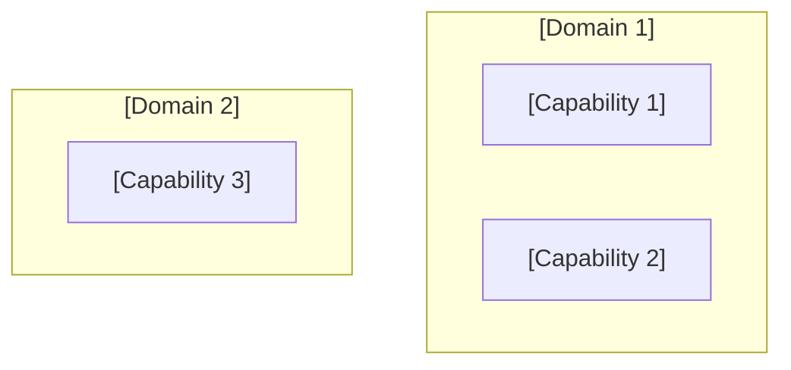

# Phase A — Architecture Vision

## Purpose

Phase A defines the scope, stakeholders, business drivers, and high-level target state for an architecture engagement. It produces the **Architecture Vision document** and the **Statement of Architecture Work** — the two artefacts that gate the start of Phases B–D. A Phase A document that does not earn stakeholder sign-off cannot proceed.

---

## Artifact Guide

### Diagrams

| Situation | Diagram | Why |
|-----------|---------|-----|
| ≥ 4 stakeholder groups with different concerns | **Stakeholder map** (power/interest quadrant as Mermaid quadrant or annotated table) | Shows who has influence vs. interest — informs communication strategy |
| System interacts with external actors or systems | **Context diagram** (C4 Level 1 / Mermaid C4Context) | Establishes system boundary; shows what is in scope vs. what is external |
| Architecture spans multiple capability domains | **Capability overview** (layered Mermaid flowchart) | Shows the capability landscape at one glance — C-level readable |
| Architecture has phased delivery | **High-level roadmap timeline** (Mermaid gantt or flowchart with H1/H2/H3 subgraphs) | Makes the ambition and timeline visible before the detail |

**Mermaid rules:** `<br>` for line breaks in node labels. Keep context diagram scoped to the system boundary — never show internal components at Phase A.

### Tables

| Table | Always / Conditional | Purpose |
|-------|---------------------|---------|
| Stakeholder concerns matrix | Always | Role → primary concern → architecture implication |
| Constraints log | Always | Regulatory / budget / timeline / contractual constraints — non-negotiable |
| Architecture Principles traceability | When ≥ 3 principles apply | Shows how each principle shapes Phase B–D decisions |
| Open questions registry | Always | Unresolved questions that must be answered before Phase B starts |
| Risks and assumptions | Always | H/M/L probability × impact with owner and review trigger |
| Decision register | Always | Every material decision made in this document |

### Callouts

| Callout | When |
|---------|------|
| `> [!abstract]` | Executive summary at the top — for non-technical stakeholders |
| `> [!important]` | Non-negotiable constraints; one-way door decisions |
| `> [!warning]` | Known risks materialising before Phase B |
| `> [!info]` | Cross-references to related ADRs or prior architecture documents |
| `> [!question]` | Open questions requiring resolution before proceeding |

---

## Template

```yaml
---
title: [title]
created: [YYYY-MM-DD]
status: Draft
phase: A
lead_architect: [name or role]
stakeholders: [comma-separated roles]
horizon: [H1 / H2 / H3]
tags: []
---
```

> [!abstract]
> *[3–5 sentences for non-technical stakeholders: what problem this architecture addresses, what the target state delivers, and what decision is needed now. Pyramid Principle — recommendation first.]*

---

## 1. Business Context

> [!important]
> *So what? Every paragraph in this section must name a business consequence — not just describe a situation.*

*What business problem or opportunity is this architecture addressing? Who is the customer, and what outcome do they need?*

*Work backwards: if this architecture succeeds fully, what measurable change occurs for the customer or the business in 12 months? In 3 years?*

*What happens if this architecture is not delivered — what is the cost of inaction?*

**Business outcome (one sentence):** [state the outcome this architecture serves, working backwards from the customer]

**Horizon:** H1 / H2 / H3

---

## 2. Stakeholders & Concerns

*Who has a stake in this architecture? For each role: what do they need to know, decide, or approve? What is their primary concern?*

### Stakeholder Concerns Matrix

| Stakeholder (role) | Primary concern | Architecture implication | Communication need |
|-------------------|----------------|------------------------|-------------------|
| *[role]* | *[what they care most about]* | *[how the architecture addresses or creates risk for their concern]* | *[decision / alignment / awareness]* |

### Stakeholder Map

*Place each stakeholder in the power/interest quadrant. High power + high interest = manage closely. High power + low interest = keep satisfied. Low power + high interest = keep informed. Low power + low interest = monitor.*

| | High Interest | Low Interest |
|---|---|---|
| **High Power** | *[manage closely]* | *[keep satisfied]* |
| **Low Power** | *[keep informed]* | *[monitor]* |

*[Optionally: Mermaid C4Context or flowchart showing stakeholder groups and their relationship to the system]*

---

## 3. Scope & Constraints

*What is in scope? What is explicitly out of scope? What are the non-negotiable constraints?*

**In scope:** [list capabilities, systems, or processes this architecture addresses]

**Out of scope:** [list what is explicitly excluded — this prevents scope creep]

### Constraints Log

| Constraint | Type | Source | Impact on architecture |
|-----------|------|--------|----------------------|
| *[constraint]* | Regulatory / Budget / Timeline / Contract / Technical | *[origin]* | *[how it limits design choices]* |

> [!important]
> *[Flag any constraint that is a one-way door — a constraint that, once accepted, closes off future architectural options.]*

---

## 4. Architecture Principles

*What principles govern this architecture? For each principle: state it, name the implication for Phase B–D, and flag if any current practice violates it.*

### Principles Traceability

| Principle | Statement | Phase B–D implication | Current state vs. principle |
|-----------|-----------|----------------------|----------------------------|
| *[principle name]* | *[one sentence]* | *[how this principle shapes downstream decisions]* | *[gap: compliant / partial / non-compliant]* |

---

## 5. Architecture Vision

*What does the target state look like in 3–5 years if assumptions hold — and if they don't?*

*Working backwards: what must be true at the target state for the business outcome (Section 1) to be achieved? What capabilities must exist? What must have changed?*

**Target state summary:** [2–3 sentences describing the target state — capability-focused, not technology-focused]

**Horizon:** H1 / H2 / H3

*[Mermaid context diagram — C4 Level 1 showing the target system in its environment: external actors, adjacent systems, boundary. Label it "Target State"]*

```mermaid
C4Context
    title [System name] — Target State Context
    [diagram content]
```

### High-Level Capability Overview

*What capabilities does the target state provide? Group into logical domains.*



### Disruptive Alternative

*What would a bold version of this vision look like? Why might the conservative version be obsolete in 3 years? What emerging approach (AI-native, platform-as-a-product, etc.) makes the current direction look incremental?*

*[This must be a genuine challenge — not a variant of the proposed vision, but a different framing of the problem.]*

---

## 6. Gap Summary

*What is the distance between current state and target state? This is a high-level summary — detailed gap analysis happens in Phase B/C/D.*

*What are the top 3 gaps that must be closed for the vision to be achievable?*

| Gap | Current state | Target state | Priority | Phase |
|-----|--------------|-------------|----------|-------|
| *[gap name]* | *[current]* | *[target]* | P1 / P2 / P3 | H1 / H2 / H3 |

*[Confidence: proven / informed estimate / working hypothesis — one-line rationale per gap]*

---

## 7. Risks & Assumptions

> [!warning]
> *[Flag any risk that could materialise before Phase B work begins.]*

*What assumptions underlie this vision? State each explicitly. What breaks — and how badly — if each assumption is wrong?*

*Second-order effect: what downstream system or team outside this scope will be affected by this vision being pursued?*

| Risk / Assumption | Type | Probability | Impact | Mitigation | Confidence | Owner (role) | Review trigger |
|-------------------|------|-------------|--------|------------|------------|--------------|----------------|
| *[explicit statement]* | Risk / Assumption | H/M/L | H/M/L | *[action]* | proven / informed / hypothesis | *[role]* | *[evidence threshold or event]* |

**Second-order effect:** [one non-obvious downstream consequence of pursuing this vision]

---

## 8. Open Questions

> [!question]
> *These questions must be resolved before Phase B begins. Each has a named owner and a resolution deadline.*

| # | Question | Why it matters for Phase B | Owner (role) | Resolution deadline |
|---|---------|---------------------------|--------------|---------------------|
| Q1 | *[question]* | *[what Phase B decision depends on this answer]* | *[role]* | *[date or event]* |

---

## 9. Decision Register

*Capture every material decision made in this document. Each row is ADR-eligible.*

| Decision | Confidence | Reversibility | Owner (role) | Review trigger |
|----------|------------|---------------|--------------|----------------|
| *[decision — active sentence]* | proven / informed estimate / working hypothesis | one-way / two-way door | *[role]* | *[evidence threshold or event]* |

---

## 10. Statement of Architecture Work

*The Statement of Architecture Work is the formal agreement to proceed. It documents what will be delivered, by whom, by when, and at what cost.*

| Field | Value |
|-------|-------|
| **Architecture sponsor** | *[executive role committing budget and air cover]* |
| **Lead architect** | *[role]* |
| **Phases in scope** | *[B / C / D — which phases will follow this Phase A]* |
| **Deliverables** | *[list of documents to be produced]* |
| **Timeline** | *[target completion per phase]* |
| **Approval required from** | *[roles who must sign off before work starts]* |
| **Out of scope** | *[explicitly what this engagement will not address]* |

---

## 11. Broad Responsibility

*One line on the societal, environmental, regulatory, or customers-of-customers implication of this architecture vision. `N/A — [reason]` only if none plausibly applies.*

---

## Standards Bar

*Before presenting: does this scaffold, if filled in by a skilled architect, meet the bar for a client deliverable and earn stakeholder sign-off on the Statement of Architecture Work? If no — add the missing sections.*
