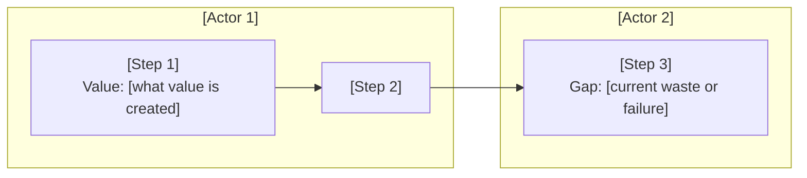

# Phase B — Business Architecture

## Purpose

Phase B defines the baseline and target business architecture: capabilities, value streams, organisational model, and processes. It translates the Phase A vision into a structured capability map with maturity scoring and ownership — the foundation that Phases C and D implement. A Phase B document that lists capabilities without ownership, maturity scores, or value stream traceability cannot drive Phase C/D work.

---

## Artifact Guide

### Diagrams

| Situation | Diagram | Why |
|-----------|---------|-----|
| ≥ 3 capability domains | **Capability heat map** (table with maturity RAG colouring) | Shows maturity distribution at a glance — identifies where to invest |
| Process spans multiple teams or roles | **Swimlane diagram** (Mermaid flowchart with subgraphs per actor) | Shows who does what and where handoffs occur |
| Architecture has distinct delivery stages / waves | **Value stream map** (Mermaid flowchart with value-adding steps and economic actors) | Shows where value is created and where waste occurs |
| Org model needs to change to support target architecture | **Org model diagram** (Mermaid flowchart or block diagram) | Makes structural changes visible |

**Mermaid rules:** `<br>` for line breaks. Swimlane subgraphs = one per actor/role. Keep value stream diagrams at business level — no technology.

### Tables

| Table | Always / Conditional | Purpose |
|-------|---------------------|---------|
| Capability map with ownership and maturity | Always | The primary Phase B artefact |
| Maturity progression table | Always | As-Is → To-Be per capability with delta |
| Value stream steps table | When ≥ 1 core value stream defined | Actor, step, value created, waste/gap |
| Capability-to-team RACI | When org model change is in scope | Decision rights per capability |
| Gap analysis (summary) | Always | Which capabilities must change — detailed in Phase C |
| Decision register | Always | Material decisions made in this document |

### Callouts

| Callout | When |
|---------|------|
| `> [!abstract]` | Executive summary for steerco — capability ambition in 3 sentences |
| `> [!important]` | Capabilities that are one-way door changes |
| `> [!warning]` | Maturity gaps with regulatory or delivery risk |
| `> [!tip]` | Ownership model or governance pattern that accelerates maturity uplift |
| `> [!info]` | Cross-reference to Phase A principles or Phase C/D implications |

---

## Template

```yaml
---
title: [title]
created: [YYYY-MM-DD]
status: Draft
phase: B
lead_architect: [name or role]
stakeholders: [comma-separated roles]
horizon: [H1 / H2 / H3]
tags: []
---
```

> [!abstract]
> *[3–5 sentences: what capability gaps this Phase B addresses, what the target business architecture enables, and what decision is needed. Recommendation first.]*

---

## 1. Baseline Business Architecture

> [!important]
> *So what? Every capability description must name the business consequence of its current maturity — not just describe what it does.*

*What capabilities, processes, and organisational structures exist today? What is working? What is broken, brittle, or approaching end-of-life?*

*Maturity scale: 0 = Not Defined · 1 = Initial · 2 = Defined · 3 = Managed · 4 = Optimised*

### Capability Map — Baseline

| Capability domain | Capability | Ownership model | As-Is maturity (0–4) | Evidence | Confidence |
|-------------------|-----------|----------------|---------------------|----------|------------|
| *[domain]* | *[capability]* | PROVIDED / INTEGRATED / GOVERNED | *[0–4 + level name]* | *[what the score is based on]* | proven / informed estimate / working hypothesis |

**Ownership model:**
- **PROVIDED** — this team/platform builds and owns this capability
- **INTEGRATED** — this team orchestrates an external capability (SaaS, partner)
- **GOVERNED** — this team sets policy; another team executes

*[Mermaid capability heat map — group capabilities by domain, annotate with maturity level. Use RAG: 🔴 0–1 · 🟡 2 · 🟢 3–4]*

---

## 2. Target Business Architecture

*What must the target business architecture look like for the Phase A vision to be achievable? Work backwards from the business outcome — not from what is technically possible.*

*Disruptive alternative: what would the most ambitious version of this target architecture look like? Why might the conservative target be insufficient in 3 years?*

**Target state summary:** [2–3 sentences — capability-focused, not technology-focused]

**Horizon:** H1 / H2 / H3

### Capability Map — Target

| Capability domain | Capability | Ownership model | To-Be maturity (0–4) | Delta | Phase |
|-------------------|-----------|----------------|---------------------|-------|-------|
| *[domain]* | *[capability]* | PROVIDED / INTEGRATED / GOVERNED | *[0–4 + level name]* | +[N] levels | H1 / H2 / H3 |

### Maturity Progression

| Capability | As-Is | To-Be | Gap (levels) | Closure approach | Priority |
|-----------|-------|-------|-------------|-----------------|----------|
| *[capability]* | *[0–4]* | *[0–4]* | *[delta]* | Uplift / Transform / New / Eliminate | P1 / P2 / P3 |

---

## 3. Value Streams

*What are the core value streams? For each: name the economic actors (who pays, who delivers, who benefits), the key steps, and where value is created vs. where waste exists today.*

*A value stream at business architecture level describes business steps — not technology or system names.*

### Value Stream: [Name]

**Economic actors:** [who pays / who delivers / who benefits]

**Steps:**



| Step | Actor | Value created | Current gap / waste | Priority |
|------|-------|--------------|---------------------|----------|
| *[step]* | *[role]* | *[outcome delivered]* | *[what breaks or slows today]* | P1 / P2 / P3 |

*[Repeat for each core value stream — typically 2–4 in a Phase B]*

---

## 4. Organisational Model

*Does the org model support the target capability ownership? Where are the decision rights misaligned? What must change in team structure or governance for the target architecture to be operable?*

*Only include this section if org model change is in scope.*

### Capability-to-Team RACI

| Capability | Driver (decides) | Approver | Contributors | Informed |
|-----------|-----------------|----------|--------------|---------|
| *[capability]* | *[role]* | *[role]* | *[roles]* | *[roles]* |

> [!warning]
> *[Flag capabilities where Driver and Approver are the same role — this is a governance risk.]*

---

## 5. Gap Analysis (Business Layer)

*What must change in capabilities, processes, or organisational structures to reach the target? This is the business-layer gap analysis — Phase C/D will drill into data, application, and technology gaps.*

| Gap ID | Capability / Process | Baseline | Target | Gap type | Priority | Owner (role) | Review trigger |
|--------|---------------------|----------|--------|----------|----------|--------------|----------------|
| GAP-B01 | *[capability]* | *[current]* | *[target]* | New / Transform / Uplift / Eliminate | P1/P2/P3 | *[role]* | *[evidence threshold or event]* |

*[Confidence per gap: proven / informed estimate / working hypothesis — one-line rationale]*

---

## 6. Roadmap

*What sequence of capability changes moves from baseline to target? Sequence by dependency order + priority.*

**H1 (now → 12 months) — Sponsor:** [executive role]

[Capabilities to establish or uplift, with dependency rationale]

**H2 (12–24 months) — Sponsor:** [role]
**H2 trigger:** [what must be true at end of H1 for H2 to begin on schedule]

[Capabilities that depend on H1 foundations]

**H3 (24+ months) — Sponsor:** [role]
**H3 trigger:** [event or evidence threshold]

[Strategic capability investments]

---

## 7. Risks & Assumptions

> [!warning]
> *[Flag any risk that has a regulatory dimension or a hard delivery deadline.]*

*Primary assumption + failure scenario. Name the organisational risk — capability gaps on paper are often delivery risks in reality.*

*Second-order effect: which Phase C or D component will be constrained by a business architecture decision made here?*

| Risk / Assumption | Type | Probability | Impact | Mitigation | Confidence | Owner (role) | Review trigger |
|-------------------|------|-------------|--------|------------|------------|--------------|----------------|
| *[explicit statement]* | Risk / Assumption | H/M/L | H/M/L | *[action]* | proven / informed / hypothesis | *[role]* | *[evidence threshold or event]* |

**Second-order effect:** [one non-obvious downstream consequence for Phase C/D]

---

## 8. Decision Register

| Decision | Confidence | Reversibility | Owner (role) | Review trigger |
|----------|------------|---------------|--------------|----------------|
| *[decision — active sentence]* | proven / informed estimate / working hypothesis | one-way / two-way door | *[role]* | *[evidence threshold or event]* |

---

## 9. Broad Responsibility

*One line on the societal, environmental, regulatory, or customers-of-customers implication of the target business architecture. `N/A — [reason]` only if none plausibly applies.*

---

## Standards Bar

*Before presenting: does this scaffold, if filled in by a skilled architect, meet the bar for a client deliverable and provide the capability foundation that Phase C/D teams need? If no — add missing sections.*
