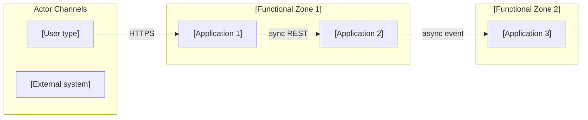
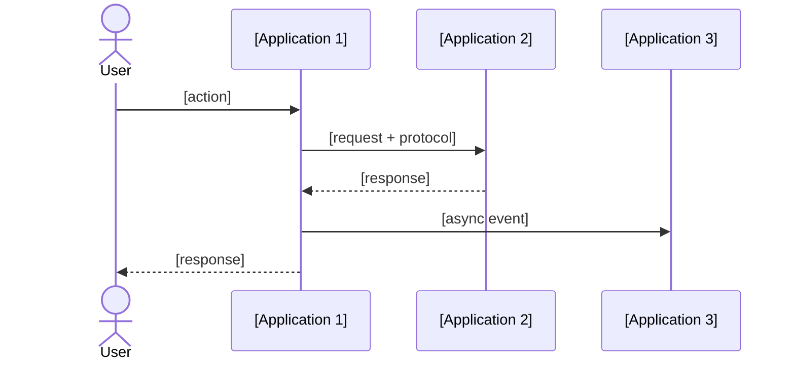

# Phase C — Application Architecture

## Purpose

Phase C (Application) defines the application portfolio, integration topology, API catalog, and application lifecycle. It translates Phase B capability targets into a concrete application layer design. A Phase C Application document without an integration topology diagram, API catalog, and application-to-capability traceability is incomplete and cannot drive Phase D technology choices.

---

## Artifact Guide

### Diagrams

| Situation | Diagram | Why |
|-----------|---------|-----|
| Always | **Application topology** (Mermaid flowchart: actor channels → functional zones → applications) | Shows how users and systems interact with the application landscape |
| Integration between applications | **Integration topology** (Mermaid flowchart: sync vs async paths highlighted, with protocol labels) | Shows coupling points; identifies integration risks |
| Process spans multiple applications | **Application sequence diagram** (Mermaid sequenceDiagram) | Shows request/response flows; identifies latency and failure points |
| As-Is portfolio differs structurally from To-Be | **As-Is / To-Be application landscape** (two Mermaid flowcharts) | Makes the architectural change explicit |
| Component boundaries and interfaces | **Component diagram** (Mermaid C4Component or flowchart) | Shows internal structure of a key application |

**Mermaid rules:** `<br>` for line breaks. Integration topology: left-to-right. Use `-->|"sync REST"` / `-.->|"async event"` edge styles to distinguish sync vs async. Actor channels on left; data/processing on right.

### Tables

| Table | Always / Conditional | Purpose |
|-------|---------------------|---------|
| Application portfolio | Always | Every application: name, owner, lifecycle status, integration style |
| Application-to-capability traceability | Always | Links Phase B capabilities to Phase C applications |
| API catalog | When ≥ 1 API is exposed | Endpoint, method, auth, rate limit, SLA, owner |
| SaaS platform inventory | When SaaS is in scope | Vendor, contract, SSO capability, API completeness, governance risk |
| Integration interface catalog | When ≥ 3 integrations exist | Source, target, protocol, SLA, data classification, owner |
| Gap analysis (application layer) | Always | Which applications must change |
| Decision register | Always | Material decisions |

### Callouts

| Callout | When |
|---------|------|
| `> [!abstract]` | Executive summary — application landscape ambition |
| `> [!important]` | One-way door integration decisions; applications approaching end-of-life |
| `> [!warning]` | Integration anti-patterns detected; missing SLA definitions; vendor lock-in risk |
| `> [!tip]` | API governance pattern or integration simplification shortcut |
| `> [!info]` | Cross-reference to Phase B capability or Phase D infrastructure choice |

---

## Template

```yaml
---
title: [title]
created: [YYYY-MM-DD]
status: Draft
phase: C-Application
lead_architect: [name or role]
stakeholders: [comma-separated roles]
horizon: [H1 / H2 / H3]
tags: []
---
```

> [!abstract]
> *[3–5 sentences: what application architecture gaps this Phase C addresses, what the target landscape enables, and what integration simplification or capability unlock it delivers. Recommendation first.]*

---

## 1. Baseline Application Architecture

> [!important]
> *So what? Every application description must name the business risk or constraint it creates — not just describe what it does.*

*What applications exist today? What is working? What is approaching end-of-life, over-coupled, or a delivery bottleneck?*

### Application Portfolio — Baseline

| Application | Owner (role) | Lifecycle status | Integration style | Phase B capability served | Known issues |
|------------|-------------|-----------------|------------------|--------------------------|-------------|
| *[app name]* | *[role]* | Active / Legacy / EOL planned / EOL overdue | REST / Event / File / Proprietary | *[Phase B GAP-B0X]* | *[technical debt, coupling, availability issues]* |

*[Mermaid As-Is application topology — actor channels on left, functional zones as subgraphs, applications as nodes. Show integration edges with protocol labels.]*


*As-Is application topology*

---

## 2. Target Application Architecture

*What must the target application landscape look like for the Phase B capability targets to be achievable? Work backwards from the business outcome.*

*Disruptive alternative: is there an emerging approach (composable architecture, headless, platform-as-a-product, AI-native) that makes the current application architecture obsolete before the target is reached?*

**Target state summary:** [2–3 sentences — capability-focused, not technology-focused]

**Horizon:** H1 / H2 / H3

*[Mermaid To-Be application topology — same format as As-Is for direct comparison]*

```mermaid
flowchart LR
    subgraph Actors["Actor Channels"]
        [To-Be actors]
    end
    subgraph Zone1["[Zone 1]"]
        [To-Be applications]
    end
```
*To-Be application topology*

---

## 3. Application-to-Capability Traceability

*Every Phase B capability gap must be traceable to one or more applications. This is the bridge between business architecture and application design.*

| Phase B Gap ID | Capability | Application(s) responsible | Type | Status |
|----------------|-----------|---------------------------|------|--------|
| GAP-B01 | *[Phase B capability name]* | *[app name(s)]* | New build / Modify existing / Replace / Retire | Planned / In progress / Complete |

> [!warning]
> *[Flag any Phase B capability with no application mapped — this is a coverage gap.]*

---

## 4. Integration Topology

*How do applications integrate? What protocols, patterns, and contracts govern each integration? Where are the coupling risks?*

### Integration Interface Catalog

| Interface ID | Source | Target | Protocol | Pattern | Data classification | SLA (latency/availability) | Owner (role) |
|-------------|--------|--------|----------|---------|---------------------|---------------------------|-------------|
| INT-001 | *[app]* | *[app]* | REST / GraphQL / gRPC / Event / File | Sync request-reply / Async pub-sub / Batch | Public / Internal / Confidential | *[targets]* | *[role]* |

### Integration Anti-Pattern Flags

> [!warning]
> *Flag any of these patterns detected in the current or proposed architecture:*
> - Point-to-point spaghetti (> 5 direct integrations per application)
> - Synchronous chain (> 3 hops in a synchronous call chain — latency and resilience risk)
> - Shared database (two applications reading/writing the same database — coupling risk)
> - Missing contract (integration without a defined schema or SLA — governance risk)
> - Missing error handling (no retry, no dead-letter queue, no circuit breaker defined)

---

## 5. API Catalog

*Every API exposed internally or externally must be catalogued. An undocumented API is an ungoverned integration.*

| API name | Endpoint | Method | Auth | Rate limit | SLA (latency / availability) | Version | Owner (role) | Consumer(s) |
|---------|---------|--------|------|-----------|------------------------------|---------|-------------|------------|
| *[name]* | *[path]* | GET / POST / PUT / DELETE | API key / OAuth2 / MTLS | *[rpm]* | *[P99 / uptime]* | *[v1.x]* | *[role]* | *[consumers]* |

*[Confidence per SLA: proven / informed estimate / working hypothesis — based on whether load tests exist]*

---

## 6. SaaS Platform Inventory

*For each SaaS platform in scope: assess governance risk, integration completeness, and vendor dependency.*

| Platform | Vendor | Contract expiry | SSO capable | API completeness | Data residency | Governance risk | Lock-in assessment |
|---------|--------|----------------|------------|-----------------|----------------|----------------|--------------------|
| *[name]* | *[vendor]* | *[date]* | Yes / No | Full / Partial / Limited | *[regions]* | Low / Medium / High | *[what switching costs]* |

---

## 7. Key Application Interactions

*For the most critical business flows, show the application interaction sequence. Identify latency budgets and failure points.*

### Flow: [Name — e.g., "Customer Order Processing"]



| Step | Latency budget | Failure mode | Recovery |
|------|---------------|-------------|---------|
| *[step]* | *[ms]* | *[what breaks]* | *[automatic / manual]* |

---

## 8. Gap Analysis (Application Layer)

| Gap ID | Application / Interface | As-Is | To-Be | Gap type | Priority | Reversibility | Owner (role) | Review trigger |
|--------|------------------------|-------|-------|----------|----------|---------------|--------------|----------------|
| GAP-C-A01 | *[app or interface]* | *[current]* | *[target]* | New / Transform / Uplift / Eliminate | P1/P2/P3 | one-way / two-way | *[role]* | *[evidence threshold or event]* |

---

## 9. Risks & Assumptions

*Primary assumption + failure scenario. Commoditisation check: is anything being custom-built in integration or application middleware that is becoming a managed product?*

*Second-order effect: which Phase D technology choice will be constrained by application architecture decisions made here?*

| Risk / Assumption | Type | Probability | Impact | Mitigation | Confidence | Owner (role) | Review trigger |
|-------------------|------|-------------|--------|------------|------------|--------------|----------------|
| *[explicit statement]* | Risk / Assumption | H/M/L | H/M/L | *[action]* | proven / informed / hypothesis | *[role]* | *[evidence threshold or event]* |

**Second-order effect:** [one non-obvious downstream consequence for Phase D]

---

## 10. Decision Register

| Decision | Confidence | Reversibility | Owner (role) | Review trigger |
|----------|------------|---------------|--------------|----------------|
| *[decision — active sentence]* | proven / informed estimate / working hypothesis | one-way / two-way door | *[role]* | *[evidence threshold or event]* |

---

## 11. Broad Responsibility

*One line: GDPR data flow exposure · vendor lock-in and customer portability risk · API deprecation impact on downstream consumers · customers-of-customers impact. `N/A — [reason]` only if none plausibly applies.*

---

## Standards Bar

*Before presenting: does this scaffold, if filled in by a skilled architect, provide the integration topology and API contracts that Phase D teams need to design the technology layer? If no — add missing sections.*
