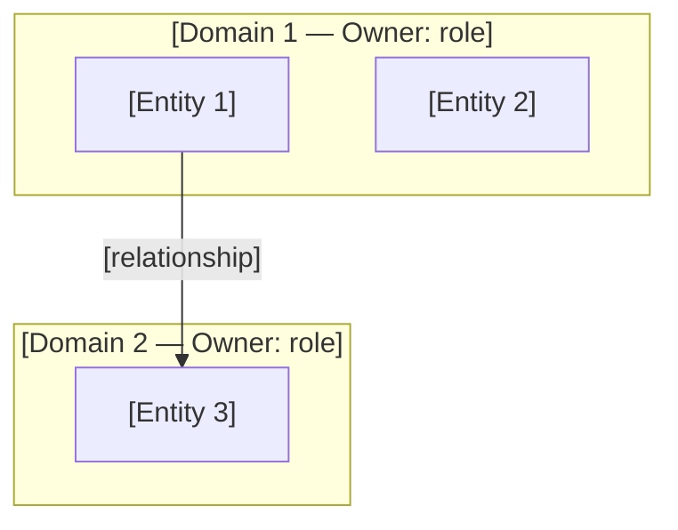
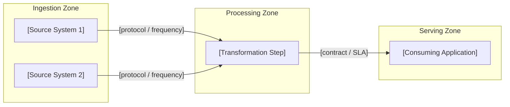
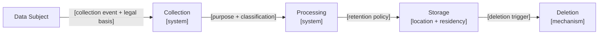

# Phase C — Data Architecture

## Purpose

Phase C (Data) defines the logical and physical data architecture: data domains, classification, lineage, governance model, data products, and privacy posture. It translates Phase B capability targets into a concrete data layer design. A Phase C Data document without a classification matrix, data product catalog, and GDPR/AI Act posture assessment is incomplete and creates regulatory exposure.

---

## Artifact Guide

### Diagrams

| Situation | Diagram | Why |
|-----------|---------|-----|
| Multiple data domains with different owners | **Data domain map** (Mermaid flowchart grouping data entities by domain and ownership) | Shows domain boundaries and accountability at a glance |
| Data flows across systems or zones | **Data lineage diagram** (Mermaid flowchart: source → processing → serving, with classification annotations) | Shows where data comes from and who consumes it |
| Personal data is processed | **GDPR data flow map** (Mermaid flowchart: data subject → collection → processing → storage → deletion, with legal basis per step) | Makes GDPR compliance surface visible and auditable |
| Conceptual → Logical → Physical model | **Conceptual data model** (Mermaid ER diagram — entities and relationships, no technical types) | Establishes shared vocabulary; input to logical model |
| As-Is data architecture differs structurally from To-Be | **As-Is / To-Be data topology** (two Mermaid flowcharts side by side) | Shows architectural change explicitly |

**Mermaid rules:** `<br>` for line breaks. ER diagrams use Mermaid `erDiagram` syntax. Lineage diagrams: left-to-right, group by zone (ingestion / processing / serving).

### Tables

| Table | Always / Conditional | Purpose |
|-------|---------------------|---------|
| Data classification matrix | Always | Asset × confidentiality × retention × residency × lineage traceability |
| Data product catalog | When ≥ 1 data product defined | Asset, owner, SLA, refresh frequency, access model |
| Data governance RACI | Always | Who owns, stewards, and consumes each data domain |
| Data quality SLA table | When data quality is a stated requirement | Accuracy / completeness / timeliness targets per domain |
| Privacy register | When personal data is processed | Processing purpose, legal basis, data subject, retention, residency |
| Gap analysis (data layer) | Always | Which data capabilities must change from Phase B |
| Decision register | Always | Material decisions — each ADR-eligible |

### Callouts

| Callout | When |
|---------|------|
| `> [!abstract]` | Executive summary — data ambition in 3 sentences |
| `> [!important]` | GDPR / AI Act regulatory zones; one-way door data decisions |
| `> [!warning]` | Data classification gaps; missing lineage; residency violations |
| `> [!tip]` | Data contract pattern or governance shortcut |
| `> [!info]` | Cross-reference to Phase B capability or Phase D technology choice |

---

## Template

```yaml
---
title: [title]
created: [YYYY-MM-DD]
status: Draft
phase: C-Data
lead_architect: [name or role]
stakeholders: [comma-separated roles]
horizon: [H1 / H2 / H3]
tags: []
---
```

> [!abstract]
> *[3–5 sentences: what data capability gaps this Phase C addresses, what the target data architecture enables for the business, what regulatory posture it establishes. Recommendation first.]*

---

## 1. Baseline Data Architecture

> [!important]
> *So what? Every baseline description must name the business risk or cost of the current data state — not just describe what exists.*

*What data assets, domains, and flows exist today? What is well-governed? What is brittle, ungoverned, or at regulatory risk?*

**Data governance baseline:** Who owns each data domain today? Is there a data catalogue? What classification scheme is in use? What is the lineage traceability coverage?

**Data quality baseline:** What are the known data quality issues? Where do they materialise in business outcomes?

---

## 2. Target Data Architecture

*What must the target data architecture look like for the Phase B capability targets to be achievable? Work backwards from the business outcome.*

*Disruptive alternative: is there an emerging approach (data mesh, data lakehouse, AI-native data fabric, real-time streaming) that makes the current direction look conservative or premature?*

**Target state summary:** [2–3 sentences — data capability-focused, not technology-focused]

**Horizon:** H1 / H2 / H3

### As-Is / To-Be Data Topology

*[Two Mermaid flowcharts: As-Is and To-Be. Show data domains, flows, and zone boundaries. Keep at logical level — technology details go to Phase D.]*

```mermaid
flowchart LR
    subgraph "As-Is Data Topology"
        [As-Is content]
    end
```

```mermaid
flowchart LR
    subgraph "To-Be Data Topology"
        [To-Be content]
    end
```

---

## 3. Data Classification Matrix

> [!important]
> *Data not classified is data not governed. Every data asset in scope must have a row here.*

| Data asset | Domain | Confidentiality | Retention | Residency | Lineage traceability | Confidence |
|-----------|--------|----------------|-----------|-----------|---------------------|------------|
| *[asset]* | *[domain]* | Public / Internal / Confidential / Restricted | *[period]* | *[countries/regions]* | Full / Partial / None | proven / informed / hypothesis |

**Confidentiality levels:**
- **Public** — no restrictions; safe to share externally
- **Internal** — for internal use only; not regulated
- **Confidential** — business sensitive; restricted access; may include personal data
- **Restricted** — highest sensitivity; regulatory obligations; strict access controls

> [!warning]
> *[Flag assets where lineage traceability = None and confidentiality = Confidential or Restricted — this is a Critical gap.]*

---

## 4. Data Domain Model

*What are the logical data domains? For each domain: who owns it, what are the core entities, and what are the interfaces to other domains?*

### Data Domain Map



### Conceptual Data Model

*Entities and relationships — no technical data types. This is the shared vocabulary.*

```mermaid
erDiagram
    [ENTITY1] ||--o{ [ENTITY2] : "[relationship]"
    [ENTITY2] }o--|| [ENTITY3] : "[relationship]"
```

---

## 5. Data Lineage

*Where does data originate? How does it flow through processing zones to consuming applications? Where does transformation occur? Where does personal data enter and exit?*



*[Annotate flows carrying personal data — these become GDPR data flow inputs.]*

---

## 6. Data Product Catalog

*A data product is a governed, reusable data asset with a defined owner, SLA, and access model. List every data product in scope.*

| Data product | Domain | Owner (role) | Consumers | Refresh SLA | Quality SLA | Access model | Catalog location |
|-------------|--------|-------------|----------|-------------|-------------|--------------|-----------------|
| *[name]* | *[domain]* | *[role]* | *[roles/systems]* | *[frequency]* | *[accuracy/completeness/timeliness targets]* | Self-serve / Governed / Restricted | *[catalogue entry]* |

---

## 7. Data Governance Model

*Who owns each data domain? Who stewards data quality? Who approves access? How are data contracts enforced between producers and consumers?*

### Governance RACI

| Data domain | Data Owner (role) | Data Steward (role) | Access Approver (role) | Audit responsibility |
|------------|------------------|--------------------|-----------------------|---------------------|
| *[domain]* | *[role — accountable for quality and policy]* | *[role — day-to-day quality monitoring]* | *[role — approves access requests]* | *[role]* |

### Data Contracts

*A data contract is a formal agreement between a data producer and a data consumer specifying schema, SLA, and breaking-change policy.*

| Interface | Producer | Consumer | Schema format | Freshness SLA | Breaking-change policy | Owner (role) |
|-----------|---------|---------|---------------|---------------|----------------------|-------------|
| *[contract name]* | *[system/team]* | *[system/team]* | *[format]* | *[latency/frequency]* | *[versioning/notification policy]* | *[role]* |

---

## 8. Privacy & Data Protection

> [!important]
> *This section is mandatory when personal data is processed. Flag immediately if personal data is in scope and this section is blank.*

*What personal data is processed? Under what legal basis? What are the data minimisation, retention, residency, and consent obligations?*

### Privacy Register

| Data category | Data subjects | Processing purpose | Legal basis | Retention | Residency | Consent management | DPO review needed |
|--------------|--------------|-------------------|-------------|-----------|-----------|-------------------|------------------|
| *[category]* | *[who]* | *[why processed]* | Consent / Contract / Legal obligation / Legitimate interest | *[period]* | *[countries]* | *[mechanism]* | Yes / No |

### GDPR Data Flow Map



**AI Act considerations** *(if AI / ML models are in scope)*:
- Risk tier: Unacceptable / High / Limited / Minimal
- Transparency obligations: [logging, explainability, human oversight requirements]
- Data quality obligations: [training data governance, bias monitoring]

---

## 9. Gap Analysis (Data Layer)

*What must change in data capabilities, governance, or quality to reach the target? Reference Phase B gap IDs where applicable.*

| Gap ID | Capability / Asset | As-Is | To-Be | Gap type | Priority | Reversibility | Owner (role) | Review trigger |
|--------|-------------------|-------|-------|----------|----------|---------------|--------------|----------------|
| GAP-C-D01 | *[capability]* | *[current]* | *[target]* | New / Transform / Uplift / Eliminate | P1/P2/P3 | one-way / two-way | *[role]* | *[evidence threshold or event]* |

> [!warning]
> *[Flag gaps with regulatory deadline — GDPR notification window, AI Act compliance date, contractual audit.]*

---

## 10. Risks & Assumptions

*Primary assumption + failure scenario. Commoditisation check: is anything being custom-built in data processing or governance that is becoming a managed product?*

*Second-order effect: which application (Phase C-App) or infrastructure component (Phase D) will be constrained by data architecture decisions made here?*

| Risk / Assumption | Type | Probability | Impact | Mitigation | Confidence | Owner (role) | Review trigger |
|-------------------|------|-------------|--------|------------|------------|--------------|----------------|
| *[explicit statement]* | Risk / Assumption | H/M/L | H/M/L | *[action]* | proven / informed / hypothesis | *[role]* | *[evidence threshold or event]* |

**Second-order effect:** [one non-obvious downstream consequence for Phase C-App or Phase D]

---

## 11. Decision Register

| Decision | Confidence | Reversibility | Owner (role) | Review trigger |
|----------|------------|---------------|--------------|----------------|
| *[decision — active sentence]* | proven / informed estimate / working hypothesis | one-way / two-way door | *[role]* | *[evidence threshold or event]* |

---

## 12. Broad Responsibility

*One line covering: GDPR / AI Act exposure tier · cross-border data residency · fairness or bias risk in derived models · environmental footprint of storage/compute · downstream client and customers-of-customers impact. `N/A — [reason]` only if none plausibly applies.*

---

## Standards Bar

*Before presenting: does this scaffold, if filled in by a skilled architect, meet the bar for a client deliverable — including regulatory reviewers and a DPO? If no — add missing sections.*
