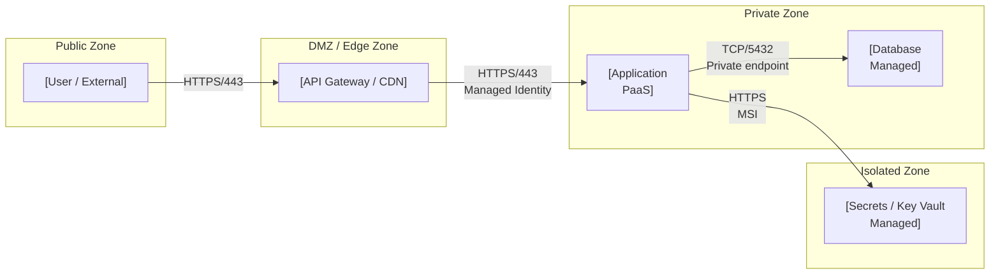

# Phase D — Technology Architecture

## Purpose

Phase D defines the technology architecture: infrastructure topology, security zones, deployment model, environments matrix, HA/DR strategy, network flows, and lock-in register. It translates Phase C application and data designs into concrete technology choices. A Phase D document without security zone boundaries, an environments matrix, RTO/RPO targets per service, and a lock-in register is incomplete and cannot drive delivery.

---

## Artifact Guide

### Diagrams

| Situation | Diagram | Why |
|-----------|---------|-----|
| Always | **Deployment topology** (Mermaid flowchart: actor → security zone → infrastructure component) | Shows what runs where and what security boundaries apply |
| Always | **Network flow matrix** (table: flow ID × source × target × protocol × auth × SLA × network element) | Makes every network path explicit — the Architecture Contract |
| Infrastructure spans regions or availability zones | **Multi-region / HA topology** (Mermaid flowchart with region subgraphs) | Shows resilience strategy and data residency |
| Container / module inventory is complex | **Module-to-infrastructure traceability** (table: logical module → technology product → infrastructure offer → zone) | Connects Phase C application decisions to physical deployment |
| As-Is infrastructure differs structurally from To-Be | **As-Is / To-Be infrastructure topology** (two Mermaid flowcharts) | Makes the migration scope explicit |

**Mermaid rules:** `<br>` for line breaks. Security zones as subgraphs with thick-border notation in labels. Show zone boundaries explicitly — ambiguity in zone membership is a security risk.

### Tables

| Table | Always / Conditional | Purpose |
|-------|---------------------|---------|
| Technology standards catalog | Always | Standard technology choices per architectural layer |
| Environments matrix | Always | Dev / Staging / Prod per infrastructure service |
| Network flow matrix | Always | Every network path — the Architecture Contract |
| Module-to-infrastructure traceability | Always | Phase C module → Phase D technology component |
| HA/DR table | Always | RTO/RPO per service with failover mechanism |
| Lock-in register | Always | Hard dependencies, switching cost, exit strategy |
| Well-Architected lens mapping | When cloud platform is in scope | WAF pillars mapped to building blocks |
| Decision register | Always | Material decisions |

### Callouts

| Callout | When |
|---------|------|
| `> [!abstract]` | Executive summary — infrastructure ambition and cost model |
| `> [!important]` | One-way door technology choices; hard lock-in |
| `> [!warning]` | Single points of failure; missing HA; network path without defined SLA |
| `> [!tip]` | Infrastructure pattern or managed service that eliminates custom build |
| `> [!info]` | Cross-reference to Phase C application or Well-Architected guidance |

---

## Template

```yaml
---
title: [title]
created: [YYYY-MM-DD]
status: Draft
phase: D
lead_architect: [name or role]
stakeholders: [comma-separated roles]
horizon: [H1 / H2 / H3]
tags: []
---
```

> [!abstract]
> *[3–5 sentences: what technology choices this Phase D makes, what infrastructure ambition it encodes, and what the unit economics look like at scale. Recommendation first.]*

---

## 1. Baseline Technology Architecture

> [!important]
> *So what? Every technology component description must name the business risk or technical debt it creates — not just describe what it is.*

*What technology stack, platforms, and infrastructure exist today? What is approaching end-of-life? What is locked-in? Where is the technical debt concentration?*

*Apply the commoditisation curve: genesis / custom-built / product / utility. Flag anything being maintained as custom-built that has drifted to product or utility.*

---

## 2. Target Technology Architecture

*What must the target technology architecture look like for Phase C designs to be implemented and operated reliably?*

*Disruptive alternative: what would a cloud-native, AI-native, or open-source version of this architecture look like? Why might the current direction create lock-in that costs more to exit than to avoid?*

**Target state summary:** [2–3 sentences — infrastructure and operations focused]

**Horizon:** H1 / H2 / H3

### Deployment Topology

*[Mermaid flowchart — actor channels → security zones → infrastructure components. Show zone boundaries as subgraphs. Use PaaS/SaaS/Managed labels per component.]*


*Target deployment topology*

---

## 3. Technology Standards Catalog

*What technology standards apply to each architectural layer? These are the decisions that constrain Phase C implementation choices.*

| Layer | Standard technology | Rationale | Commoditisation level | Confidence |
|-------|--------------------|-----------|-----------------------|------------|
| API Gateway | *[technology]* | *[why this standard]* | Genesis / Custom / Product / Utility | proven / informed / hypothesis |
| Identity / Auth | *[technology]* | *[rationale]* | *[level]* | *[confidence]* |
| Container orchestration | *[technology]* | *[rationale]* | *[level]* | *[confidence]* |
| Observability | *[technology]* | *[rationale]* | *[level]* | *[confidence]* |
| Data storage | *[technology per tier]* | *[rationale]* | *[level]* | *[confidence]* |
| Secret management | *[technology]* | *[rationale]* | *[level]* | *[confidence]* |
| CI/CD | *[technology]* | *[rationale]* | *[level]* | *[confidence]* |

---

## 4. Module-to-Infrastructure Traceability

*Every logical module from Phase C must map to a technology product, infrastructure offer, and security zone. Gaps in this table = Phase C modules without a technology home.*

| Phase C module | Technology product | Infrastructure offer | Zone | Scaling model | Owner (role) |
|---------------|-------------------|--------------------|------|--------------|-------------|
| *[Phase C app or component]* | *[technology name]* | PaaS / SaaS / Managed / IaaS / Self-hosted | Public / DMZ / Private / Isolated | Horizontal / Vertical / Fixed | *[role]* |

---

## 5. Environments Matrix

*Every infrastructure service must be provisioned per environment. Gaps in this table = environments where services are missing or undefined.*

| Infrastructure service | Dev | Staging | Production | Notes |
|-----------------------|-----|---------|------------|-------|
| *[service name]* | *[instance type / size / config]* | *[config]* | *[config]* | *[parity notes — where staging diverges from prod is a risk]* |

> [!warning]
> *[Flag any production service with no staging equivalent — this is a release risk. Flag any staging environment with significantly lower capacity than production — this masks performance issues.]*

---

## 6. Network Flow Matrix

*Every network path must be documented. This is the Architecture Contract for network security teams and infrastructure engineers. An undocumented network flow is either a security gap or a delivery surprise.*

| Flow ID | Source | Target | Protocol / Port | Auth mechanism | Data classification | SLA (latency / availability) | Network element | Owner (role) |
|---------|--------|--------|----------------|---------------|--------------------|-----------------------------|----------------|-------------|
| N1 | *[actor / component]* | *[component]* | HTTPS/443 | *[API key / OAuth2 / MSI / MTLS]* | Public / Confidential | *[P99 ms / % uptime]* | *[WAF / APIM / LB / NSG]* | *[role]* |
| N2 | *[component]* | *[component]* | *[protocol]* | *[auth]* | *[class]* | *[targets]* | *[element]* | *[role]* |

*[Confidence per SLA: proven (load tested) / informed estimate / working hypothesis]*

---

## 7. HA / DR Strategy

*For each critical service: what is the availability target? What is the recovery strategy if it fails? Who executes the recovery?*

| Service | Availability target | RTO | RPO | Failover mechanism | Backup strategy | Recovery owner (role) |
|---------|--------------------|----|-----|-------------------|----------------|----------------------|
| *[service]* | *[% uptime SLA]* | *[time to restore]* | *[max data loss]* | Automatic / Manual | *[backup type + frequency]* | *[role]* |

> [!warning]
> *[Flag any service with RTO or RPO = "unknown" — this is an operational gap. Flag any service where failover is Manual with RTO < 1 hour — this requires runbook validation.]*

---

## 8. Lock-in Register

*Where are the hard technology dependencies? For each: is the lock-in intentional (strategic bet) or accidental (path dependency)? What is the exit strategy and its cost?*

| Component | Technology / Vendor | Lock-in type | Lock-in intentional? | Exit strategy | Exit cost estimate | Review trigger |
|-----------|--------------------|-----------|-----------------------|--------------|-------------------|----------------|
| *[component]* | *[technology/vendor]* | Data / API / Skill / Contract / Ecosystem | Yes — strategic bet / No — path dependency | *[what switching looks like]* | H/M/L | *[event that mandates review — e.g., "vendor raises price > 30% or announces EOL"]* |

> [!important]
> *[Flag any lock-in rated "No — path dependency" where the exit cost is High — this is unintended lock-in that should be redesigned.]*

---

## 9. Well-Architected Lens *(cloud platform in scope only)*

*Map the relevant cloud provider's Well-Architected Framework pillars to the building blocks in this architecture. Identify gaps.*

| WAF Pillar | Building block | Assessment | Gap / Action |
|-----------|---------------|------------|-------------|
| Reliability | *[component]* | Met / Partial / Gap | *[if gap: what to add]* |
| Security | *[component]* | Met / Partial / Gap | *[action]* |
| Cost Optimisation | *[component]* | Met / Partial / Gap | *[action]* |
| Operational Excellence | *[component]* | Met / Partial / Gap | *[action]* |
| Performance Efficiency | *[component]* | Met / Partial / Gap | *[action]* |
| Sustainability | *[component]* | Met / Partial / Gap | *[action]* |

---

## 10. Gap Analysis (Technology Layer)

| Gap ID | Component / Service | As-Is | To-Be | Gap type | Priority | Reversibility | Owner (role) | Review trigger |
|--------|---------------------|-------|-------|----------|----------|---------------|--------------|----------------|
| GAP-D01 | *[component]* | *[current]* | *[target]* | New / Transform / Uplift / Eliminate | P1/P2/P3 | one-way / two-way | *[role]* | *[evidence threshold or event]* |

---

## 11. Risks & Assumptions

*Primary assumption + failure scenario. Second-order effect: what operational team or downstream system will be affected by technology choices made here?*

| Risk / Assumption | Type | Probability | Impact | Mitigation | Confidence | Owner (role) | Review trigger |
|-------------------|------|-------------|--------|------------|------------|--------------|----------------|
| *[explicit statement]* | Risk / Assumption | H/M/L | H/M/L | *[action]* | proven / informed / hypothesis | *[role]* | *[evidence threshold or event]* |

**Second-order effect:** [one non-obvious downstream consequence — typically operational burden on a team outside the design scope]

---

## 12. Decision Register

| Decision | Confidence | Reversibility | Owner (role) | Review trigger |
|----------|------------|---------------|--------------|----------------|
| *[decision — active sentence]* | proven / informed estimate / working hypothesis | one-way / two-way door | *[role]* | *[evidence threshold or event]* |

---

## 13. Broad Responsibility

*One line: carbon footprint of infrastructure choices (compute / storage / networking) · regulatory residency obligations · vendor sustainability commitments · customers-of-customers experience during incidents. `N/A — [reason]` only if none plausibly applies.*

---

## Standards Bar

*Before presenting: does this scaffold, if filled in by a skilled architect, provide the technology contract (environments, network flows, lock-in register, HA/DR) that delivery teams need? If no — add missing sections.*
